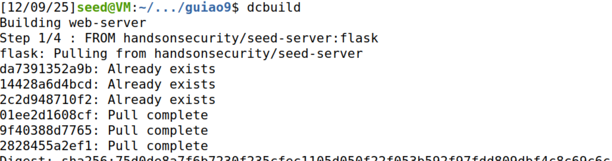
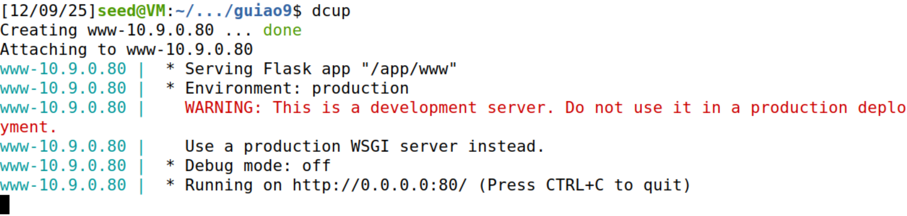
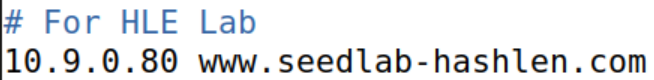
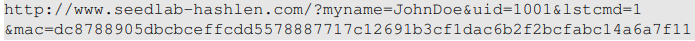
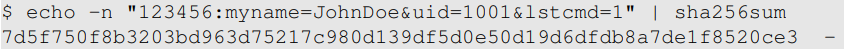
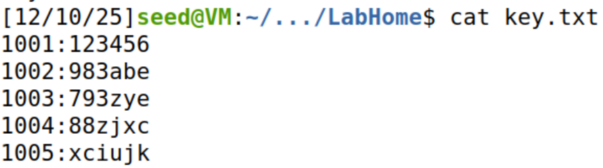
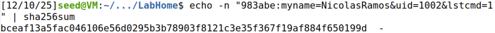
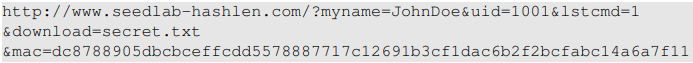
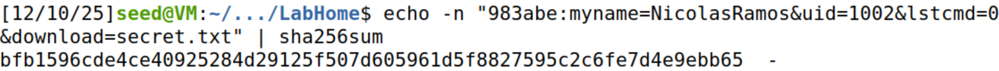
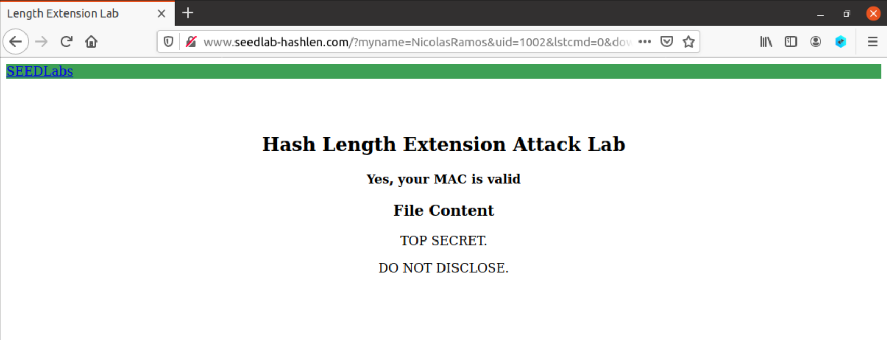

# Hash Length Extension Lab

## Setup do Ambiente

Construímos e executamos os containers docker providenciados:

Editamos o arquivo "/etc/hosts" para incluir o *web server*:

## Tarefa 1

Para a tarefa 1, o objetivo será enviar um pedido ao servidor para listar os arquivos de "LabHome", com o comando *lstcmd*. A estrutura do pedido é a seguinte:

Ou seja, temos que determinar os campos *myname*, *uid* e *mac*.

O MAC pode ser determinado a partir de uma *key* e da estrutura do pedido:

Existem alguns pares (*uid*, *key*) no arquivo "key.txt", localizado dentro do diretório "LabHome" no pacote de setup do Lab:

Para o pedido, utilizaremos o par (1002, 983abe). O campo *myname* será o nome de um dos elementos do grupo.

Com o *uid*, *key* e *myname* determinadas, podemos finalmente determinar o MAC:

MAC: **bceaf13a5fac046106e56d0295b3b78903f8121c3e35f367f19af884f650199d**

Por último, só resta enviar o pedido com os dados corretos no browser:

**http://www.seedlab-hashlen.com/?myname=NicolasRamos&uid=1002&lstcmd=1&mac=bceaf13a5fac046106e56d0295b3b78903f8121c3e35f367f19af884f650199d**

Conseguimos, então, listar os arquivos no diretório "LabHome".

### Subtarefa: Download de um arquivo

Para a subtarefa da tarefa 1, temos de enviar um pedido ao servidor para mostrar os conteúdos de um arquivo, com o comando *download*. A estrutura do pedido é a seguinte:

Aqui, será necessário calcular um novo MAC, já que o pedido tem um formato diferente:

MAC: **bfb1596cde4ce40925284d29125f507d605961d5f8827595c2c6fe7d4e9ebb65**

Podemos enviar o pedido ao servidor agora:

**www.seedlab-hashlen.com/?myname=NicolasRamos&uid=1002&lstcmd=0&download=secret.txt&mac=bfb1596cde4ce40925284d29125f507d605961d5f8827595c2c6fe7d4e9ebb65**

Conseguimos, então, os conteúdos do arquivo "secret.txt".

## Tarefa 2

## Tarefa 3