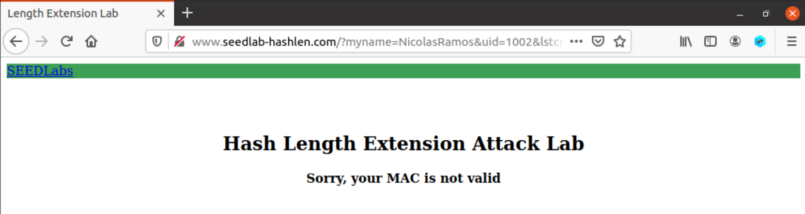

# Hash Length Extension Lab

## Setup do Ambiente

Construímos e executamos os containers docker providenciados:


Editamos o arquivo "/etc/hosts" para incluir o *web server*:


## Tarefa 1

Para a tarefa 1, o objetivo será enviar um pedido ao servidor para listar os arquivos de "LabHome", com o comando *lstcmd*. A estrutura do pedido é a seguinte:


Ou seja, temos que determinar os campos *myname*, *uid* e *mac*.

O MAC pode ser determinado a partir de uma *key* e da estrutura do pedido:


Existem alguns pares (*uid*, *key*) no arquivo "key.txt", localizado dentro do diretório "LabHome" no pacote de setup do Lab:


Para o pedido, utilizaremos o par (1002, 983abe). O campo *myname* será o nome de um dos elementos do grupo.

Com o *uid*, *key* e *myname* determinadas, podemos finalmente determinar o MAC:


``` bash
MAC: bceaf13a5fac046106e56d0295b3b78903f8121c3e35f367f19af884f650199d
```

Por último, só resta enviar o pedido com os dados corretos no browser:

``` bash
http://www.seedlab-hashlen.com/?myname=NicolasRamos&uid=1002&lstcmd=1&mac=bceaf13a5fac046106e56d0295b3b78903f8121c3e35f367f19af884f650199d
```


Conseguimos, então, listar os arquivos no diretório "LabHome".

### Subtarefa: Download de um arquivo

Para a subtarefa da tarefa 1, temos de enviar um pedido ao servidor para mostrar os conteúdos de um arquivo, com o comando *download*. A estrutura do pedido é a seguinte:


Aqui, será necessário calcular um novo MAC, já que o pedido tem um formato diferente:


``` bash
MAC: bfb1596cde4ce40925284d29125f507d605961d5f8827595c2c6fe7d4e9ebb65
```

Podemos enviar o pedido ao servidor agora:

``` bash
www.seedlab-hashlen.com/?myname=NicolasRamos&uid=1002&lstcmd=0&download=secret.txt&mac=bfb1596cde4ce40925284d29125f507d605961d5f8827595c2c6fe7d4e9ebb65
```


Conseguimos, então, os conteúdos do arquivo "secret.txt".

### E se o MAC for inválido?

Se enviarmos um pedido com um MAC inválido, o site nos avisa disso.

``` bash
Exemplo de teste: http://www.seedlab-hashlen.com/?myname=NicolasRamos&uid=1002&lstcmd=0&download=secret.txt&mac=2
```



Como é possível verificar na imagem, o comando especificado também não é executado.

## Tarefa 2

Para a tarefa 2, será necessário construir o *padding* do bloco de SHA-256 para a seguinte mensagem:

``` bash
983abe:myname=NicolasRamos&uid=1002&lstcmd=1
```

Esta mensagem possui 44 bytes, ou seja, 44 * 8 = 352 bits. Isso corresponde a 0x160 em hexadecimal.

Para completar os 64 bytes do bloco do SHA-256, faltam 64 - 44 = 20 bytes de padding, que deverão ser preenchidos com bytes "vazios" e o tamanho da mensagem no final.

``` bash
Mensagem original: 983abe:myname=NicolasRamos&uid=1002&lstcmd=1
Padding com zeros: %80%00%00%00%00%00%00%00%00%00%00%00
Tamanho da mensagem: %00%00%00%00%00%00%01%60
```

Utilizamos um byte %80, onze bytes %00 e oito bytes no fim para o tamanho da mensagem, em ordem *Big-Endian*.

Nota: "\x" foi substituído por "%", como indicado no guião.

No final, temos:

``` bash
983abe:myname=NicolasRamos&uid=1002&lstcmd=1%80%00%00%00%00%00%00%00%00%00%00%00%00%00%00%00%00%00%01%60
```

### Extra: Padding dos restantes integrantes do grupo

O mesmo processo foi utilizado para obter o *padding* dos restantes elementos do grupo.

Mauricio Sardinha:

``` bash
Mensagem original: 983abe:myname=MauricioSardinha&uid=1002&lstcmd=1
Padding com zeros: %80%00%00%00%00%00%00%00
Tamanho da mensagem: %00%00%00%00%00%00%01%80

983abe:myname=MauricioSardinha&uid=1002&lstcmd=1%80%00%00%00%00%00%00%00%00%00%00%00%00%00%01%80
```

Hugo Alves:

``` bash
Mensagem original: 983abe:myname=HugoAlves&uid=1002&lstcmd=1
Padding com zeros: %80%00%00%00%00%00%00%00%00%00%00%00%00%00%00
Tamanho da mensagem: %00%00%00%00%00%00%01%48

983abe:myname=HugoAlves&uid=1002&lstcmd=1%80%00%00%00%00%00%00%00%00%00%00%00%00%00%00%00%00%00%00%00%00%01%48
```

## Tarefa 3

Na tarefa 3, o objetivo é gerar um MAC legítimo sem termos acesso à chave MAC.
Para isso, primeiro, obtivemos o MAC de um pedido válido, neste caso:

``` bash
myname=HugoAlves&uid=1002&lstcmd=1
```

cujo MAC será calculado a partir da seguinte mensagem:
``` bash
983abe:myname=HugoAlves&uid=1002&lstcmd=1
```

Obtivemos o seguinte MAC:


A esta mensagem, planeamos agregar o comando "download", pelo que precisamos de agregar a parcela "&download=secret.txt" ao URL, como pedido no guião.
Sendo assim, adaptando o código do length_ext.c fornecido no guião ao nosso objetivo, obtemos o seguinte programa:


Em que substituímos os argumentos de htole32 por parcelas de 8 elementos do MAC e, em SHA256_Update, colocamos "&download=secret.txt".
Após compilar e executar o length_ext, obtemos o nosso novo MAC:
 

Agora, podemos construir o novo URL com o seguinte formato, como referido no guião:
``` bash
http://www.seedlab-hashlen.com/?myname=HugoAlves&uid=1002&lstcmd=1<padding>&download=secret.txt&mac=<new-mac>
```

Em &lt;padding&gt; colocamos o padding obtido na Tarefa 2:
%80%00%00%00%00%00%00%00%00%00%00%00%00%00%00%00%00%00%00%00%00%01%48

e em &lt;new-mac&gt; colocamos o novo MAC obtido:
dfae5c8898493e2dcfc9241f7f8cf13f81e5b3974b961b26bfd83609cdee3000

No final, teremos o seguinte URL:
``` bash
http://www.seedlab-hashlen.com/?myname=HugoAlves&uid=1002&lstcmd=1%80%00%00%00%00%00%00%00%00%00%00%00%00%00%00%00%00%00%00%00%00%01%48&download=secret.txt&mac=dfae5c8898493e2dcfc9241f7f8cf13f81e5b3974b961b26bfd83609cdee3000
```

Entrando no site com este URL, obtemos:


Isto indica que o ataque foi bem sucedido. Com isto, conseguimos demonstrar que é possível, sabendo o MAC de um pedido válido, forjar um pedido novo sem precisarmos conhecer as chaves MAC.