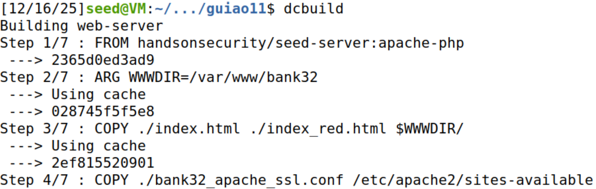
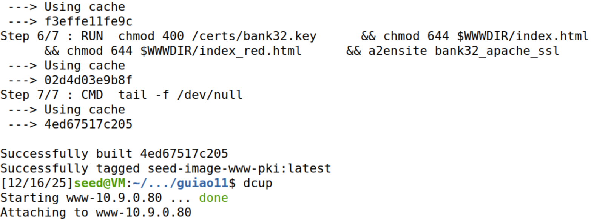
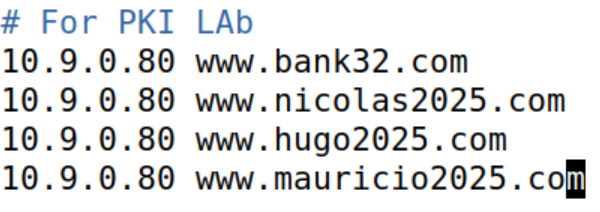

# PKI Lab

## Setup do Ambiente

Construímos e executamos os containers Docker:

Adicionamos os sites requeridos ao arquivo "/etc/hosts", completando o setup do DNS:

Nota: foram adicionados 3 sites, cada um correspondendo a um dos elementos do grupo. Isso foi feito puramente por efeitos de conveniência, para a execução e registo das tarefas sem inconsistências.

## Tarefa 1

## Tarefa 2

## Tarefa 3

## Tarefa 4

## Tarefa 5

## Tarefa 6

