# PKI Lab

## Setup do Ambiente

Construímos e executamos os containers Docker:

Adicionamos os sites requeridos ao arquivo "/etc/hosts", completando o setup do DNS:

## Tarefa 1

Para a tarefa 1, criamos uma organização *root* CA, para podermos emitir certificados digitais para outros sites.

1. Copiamos o arquivo "openssl.cnf" para o diretório onde iremos trabalhar:

2. Editamos o arquivo, descomentando a linha "unique_subject":

3. Criamos o diretório "demoCA" e os arquivos necessários dentro dele, além de editar o arquivo "serial" para incluir um número aleatório em formato de string:

4. Executamos o comando e preenchemos as informações relevantes: 

Após estes passos, registramos a organização "Evil Empire" como uma *root* CA. Podemos verificar as informações relacionadas ao certificado:

E também as informações relacionadas à chave:

### Questões

1. Que parte do certificado indica que isto é um certificado CA?

No output do certificado, temos:

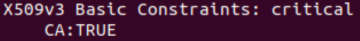

Essa extensão "Basic Constraints" identifica que o certificado tem permissão para assinar outros certificados, ou seja, é uma CA.

2. Que parte do certificado indica que isto é um certificado *self-signed*?

Um certificado é *self-signed* quando o *Issuer* (quem assina) é igual ao *Subject* (quem recebe).

É possível verificar, no certificado, que isso acontece:

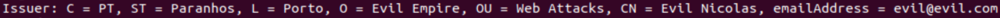
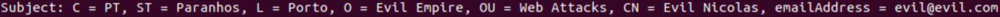

3. No algoritmo RSA, temos um expoente público *e*, um expoente privado *d*, um módulo *n* e dois números secretos *p* e *q*, tal que n = *pq*. Por favor, identifica os valores destes elementos nos teus ficheiros de certificado e chaves.

Expoente público *e*: 65537

Expoente privado *d*: número após a linha *privateExponent*.

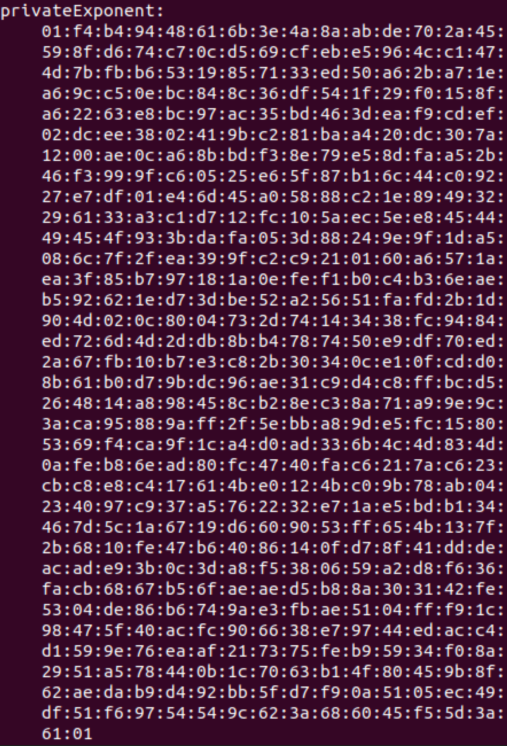

Módulo *n*: número após a linha *modulus:*.

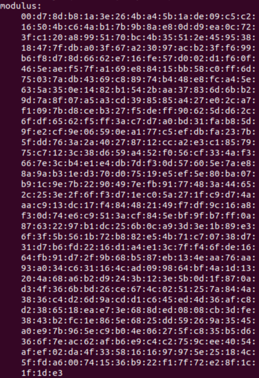

Números secretos *p* e *q*: números após as linhas *prime1* e *prime2*, respectivamente:

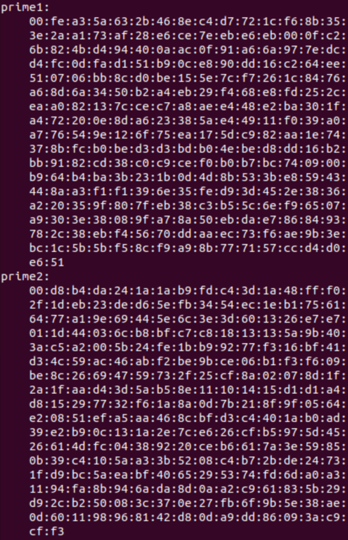

## Tarefa 2

Para a tarefa 2, vamos gerar um pedido para que a root CA assine o certificado de um site.

Executamos o seguinte comando:

Podemos verificar as informações do pedido:

## Tarefa 3

Para a task 3, vamos aceitar o pedido feito pelo site pela *root* CA, ou seja, assinar o certificado do site.

1. Descomentamos a linha "copy_extensions" do arquivo de configuração do *openssl*:

2. Executamos o comando para certificar o site com a *root* CA:

3. Checamos o estado do certificado:

## Tarefa 4

Para a tarefa 4, faremos *setup* de um site HTTPS baseado no Apache.

1. Criamos o arquivo de configuração para o Apache utilizar, utilizando as informações do site estabelecido:

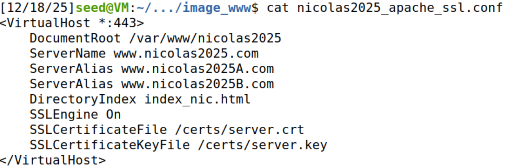
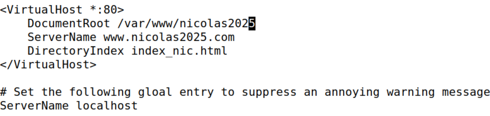

2. Movemos:

* o arquivo de configuração do Apache para o diretório "image_www".
* o certificado da CA e o certificado e chave pública do site para o diretório "image_www/certs".

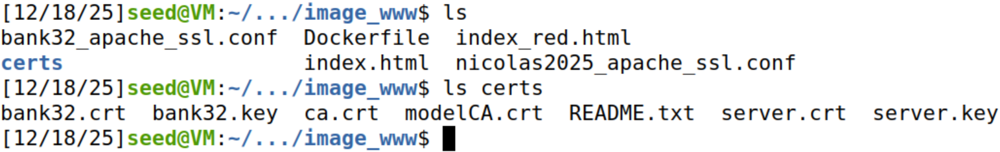

3. Criamos uma página para o site, para testarmos seu funcionamento mais tarde:

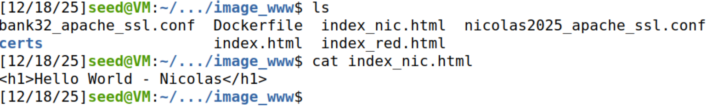

4. Editamos o Dockerfile para incluir o nosso site no setup:

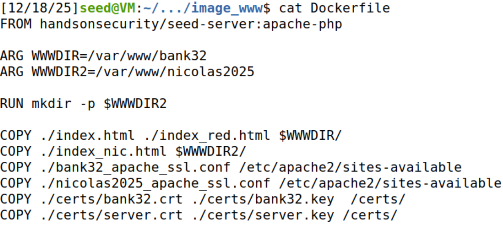
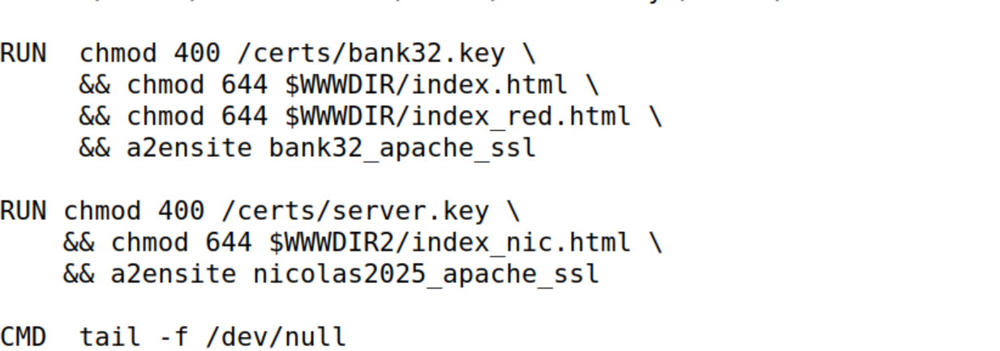

5. Reiniciamos o container Docker para aplicar as mudanças, com *dcdown*, *dcbuild --no-cache* ("--no-cache" para evitar que configurações antigas permaneçam) e *dcup -d*.

6. Iniciamos o serviço Apache dentro da shell do container:

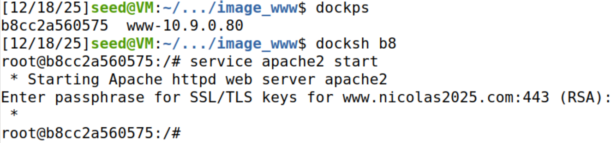

7. Verificamos que o site criado funciona, bem como "www.bank32.com":

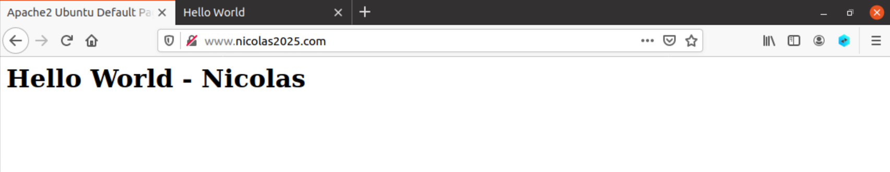
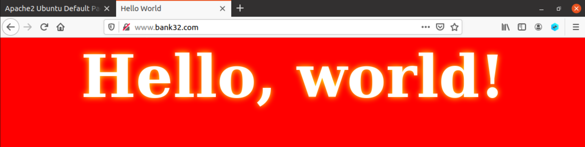

### Setup dos Aliases

Para fazer com que os *aliases* funcionem, é necessário adicioná-los ao arquivo de configuração do Apache para a porta 80:

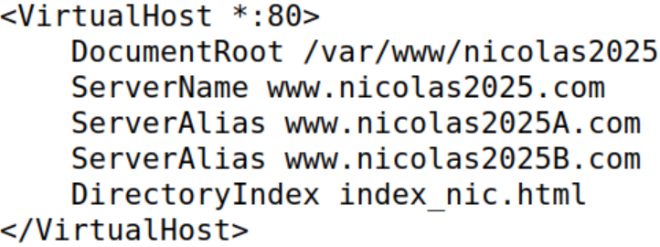

Com isso feito, reiniciamos o container (*dcdown*, *dcbuild*, *dcup*) e iniciamos o Apache novamente:

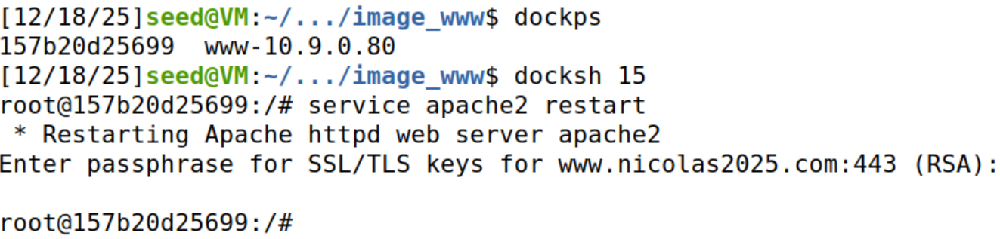

Temos, então, os *aliases* funcionando:

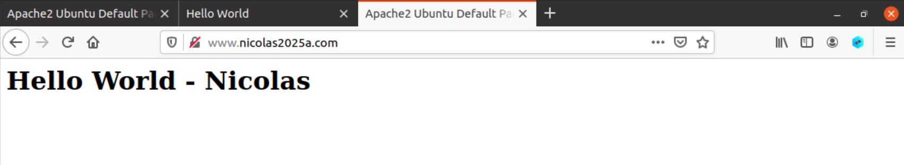

### Browsing do Website

Ao tentar acessar os sites com "https://" no início do URL, recebemos um aviso de segurança:

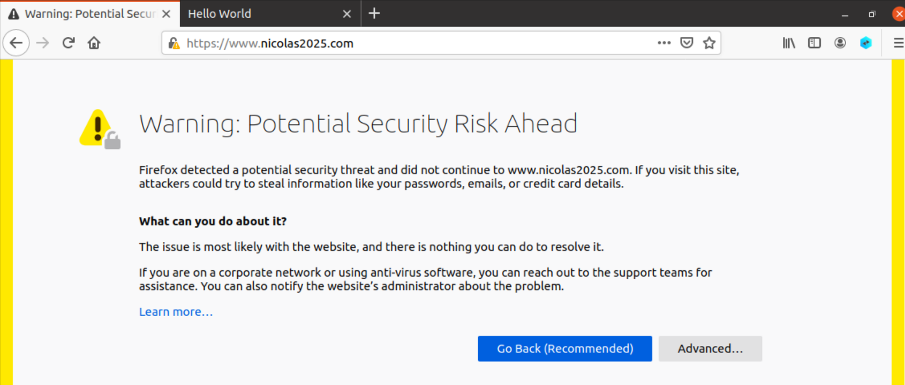

Isso acontece pois o browser utilizado (Firefox) não reconhece a CA que assinou os certificados do nosso site.

Para consertar este problema, carregamos os certificados no Firefox.

1. Visitamos a página "about:preferences#privacy" e clicamos em "View Certificates":

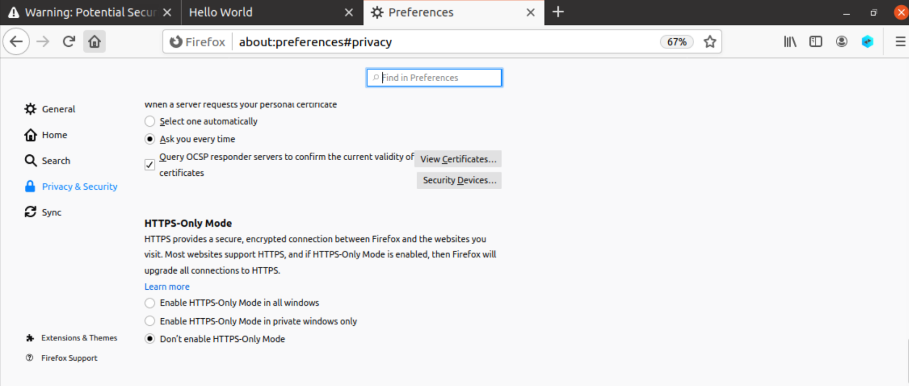

2. Na aba "Authorities", clicamos em "Import...":

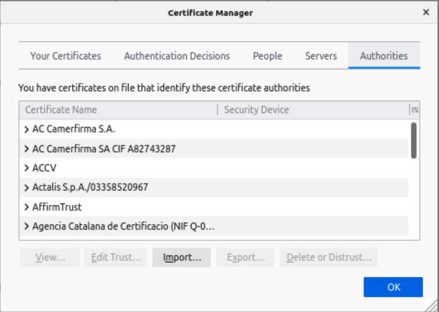

3. Selecionamos o certificado da *root* CA criada anteriormente, adicionando-a à lista de CAs confiáveis do nosso browser:

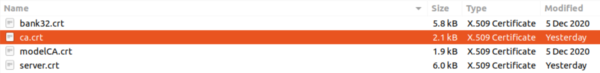

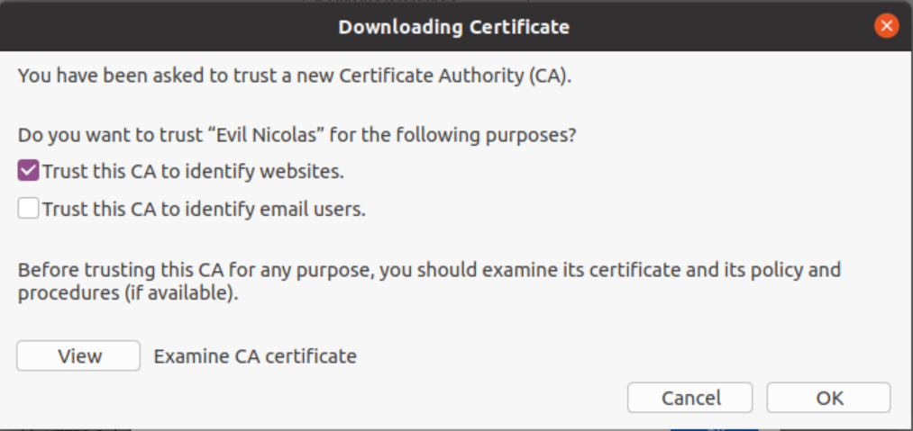

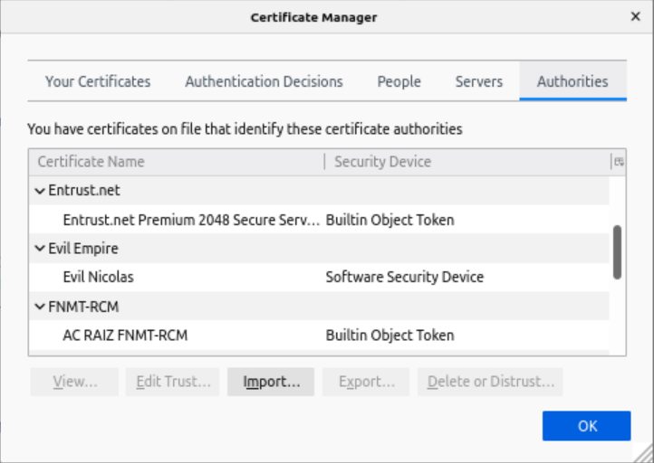

Com isso, ao acessar o site normalmente, já não recebemos mais o aviso de segurança, e o símbolo do cadeado aparece fechado (o que significa que o site é considerado seguro pelo nosso browser):

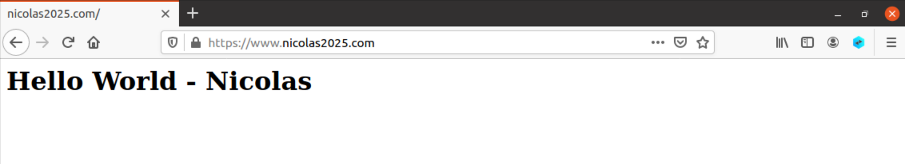

## Tarefa 5

Para a tarefa 5, simularemos um ataque MITM por meio do DNS.

1. Adicionamos o site "www.facebook.com" ao Dockerfile e ao Apache, como foi feito na tarefa 4:

1.1. Criamos o arquivo de configuração do Apache:

1.2. Criamos uma página para o site:

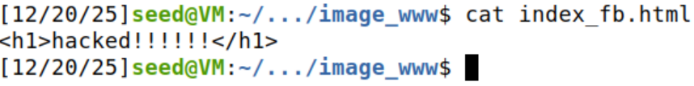

1.3. Modificamos o Dockerfile para incluir o novo site no setup do container:

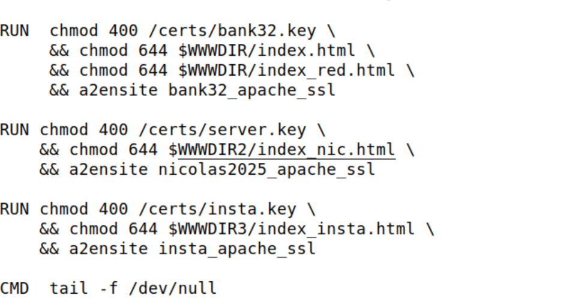

2. Reconstruímos o container (*dcdown*, *dcbuild*, *dcup*) e iniciamos o servidor Apache:

3. Modificamos o arquivo "/etc/hosts" para incluir o site falso:

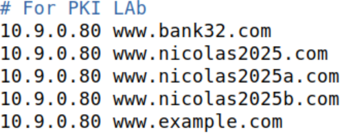

Quando o DNS é resolvido, a vítima (no caso, nós, já que se trata de um ataque simulado) acessará o "www.facebook.com" malicioso.

4. Ao tentar acessar ao site "www.facebook.com" com https, verificamos que o desvio foi bem sucedido, no entanto, o browser emitiu um aviso:

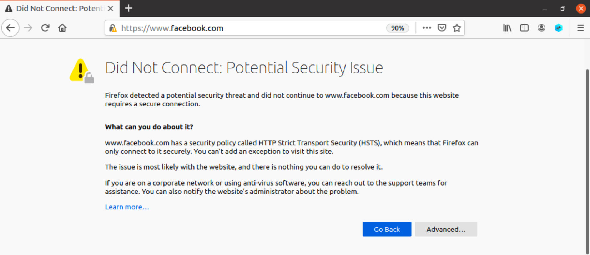

Isto deve-se ao facto de, no certificado, o nome se referir a "www.nicolas2025.com" (pois foi para este que o certificado foi emitido) e não a "www.facebook.com". Apesar de ser assinado por uma CA reconhecida pelo browser, como o nome no certificado não coincide com o endereço esperado, o browser considera o certificado inválido e lança o aviso. \
O domínio “www.facebook.com” requer uma ligação segura e utiliza políticas de segurança fortes, por isso o browser não permite estabelecer a ligação sem um certificado válido nem permite adicionar uma exceção manual. \
Desta forma, o mecanismo PKI, em conjunto com políticas como HSTS (mecanismo que obriga o navegador a usar sempre HTTPS e rejeitar conexões inseguras), impede que o atacante intercepte a comunicação, demonstrando como o HTTPS protege contra ataques MITM.

## Tarefa 6

Ao contrário do sucedido na tarefa 5, na tarefa 6 temos acesso à *private key* da CA, o que nos permite criar um novo certificado, desta vez para "www.instagram.com" e assiná-lo como se fossemos a CA. 

Para isso fizemos o seguinte:

1. Criamos o certificado para o site "www.instagram.com" falso e assinamos com a nossa *root* CA, como foi feito nas tarefas 2 e 3.

1.1. Criação do pedido pelo site:

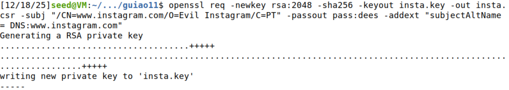

1.2. Aceitação do pedido pela *root* CA:

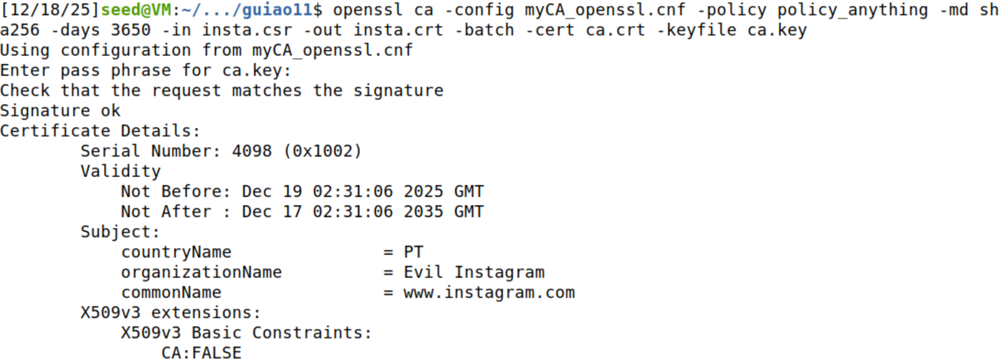
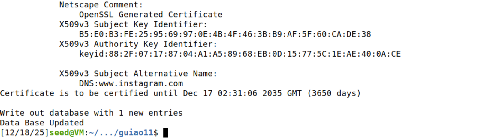

**Nota**: para o último comando funcionar, foi necessário mover, temporariamente, o certificado da *root* CA criada para o mesmo diretório no qual o comando seria executado e onde estava o arquivo de configuração do *openssl*. 

2. Adicionamos este site ao Dockerfile e ao Apache, como foi feito na tarefa 4:

2.1. Colocamos o certificado da *root* CA e o certificado e chave gerados para "www.instagram.com" no diretório "image_www/certs".

2.2. Criamos o arquivo de configuração do Apache:

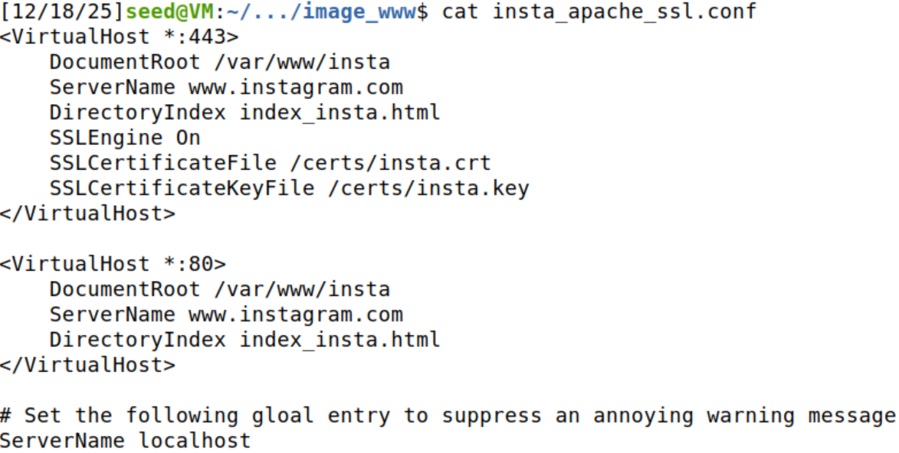

2.3. Criamos uma página para o site:

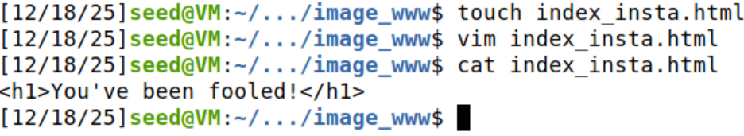

2.4. Modificamos o Dockerfile para incluir o novo site no setup do container:

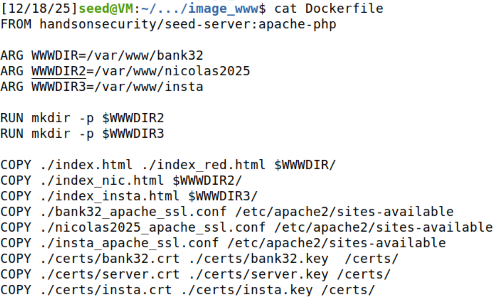

2.5. Reconstruímos o container (*dcdown*, *dcbuild*, *dcup*) e iniciamos o servidor Apache:

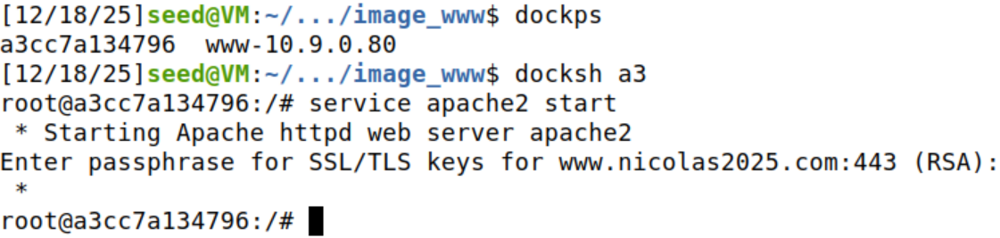

3. Ao tentar acessar ao site "www.instagram.com" com https, verificamos que o desvio foi bem sucedido e, ao contrário do resultado na tarefa 5, o site foi aberto sem qualquer aviso por parte do browser:

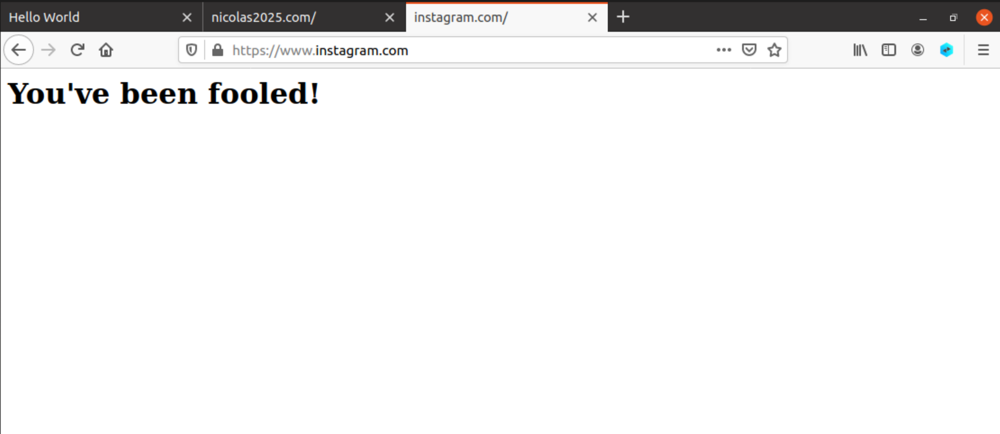

Como conseguimos acesso à chave privada da CA, isto permitiu-nos forjar um novo certificado, desta vez, com os dados adequados (como o nome) do "www.instagram.com". Ou seja, conseguimos gerar um certificado válido para o site e, como o browser confia na CA cuja chave foi usada para forjar este certificado e os dados dele coincidem e são válido, o browser confiou no site e não lançou o aviso como anteriormente.