# PKI Lab

## Setup do Ambiente

Construímos e executamos os containers Docker:

Adicionamos os sites requeridos ao arquivo "/etc/hosts", completando o setup do DNS:

Nota: foram adicionados 3 sites, cada um correspondendo a um dos elementos do grupo. Isso foi feito puramente por efeitos de conveniência, para a execução e registo das tarefas sem inconsistências.

## Tarefa 1

Para a tarefa 1, temos de criar uma organização *root* CA, para podermos emitir certificados digitais para outros sites.

1. Copiar o arquivo "openssl.cnf" para o diretório onde iremos trabalhar:

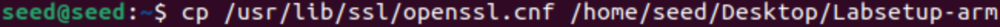

2. Editar o arquivo, de modo a descomentar a linha indicada:

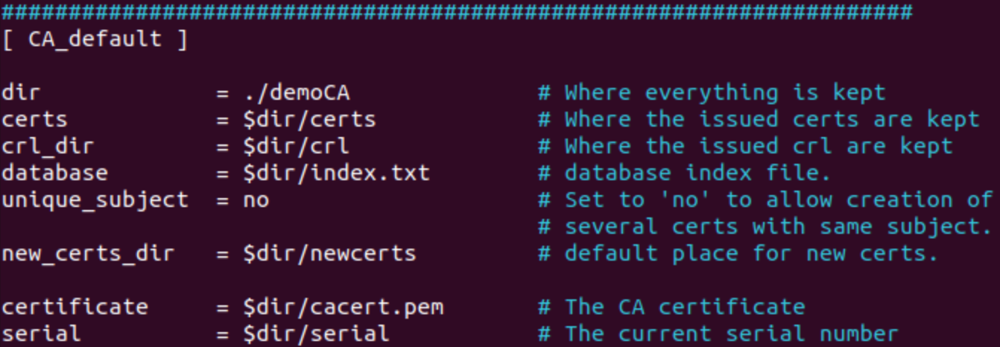

3. Criar o diretório "demoCA" e os arquivos necessários dentro dele, além de editar o arquivo "serial" para incluir um número aleatório em formato de string:

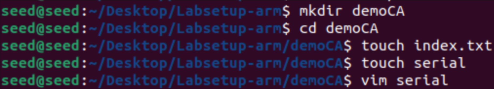
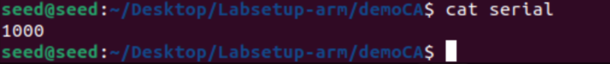
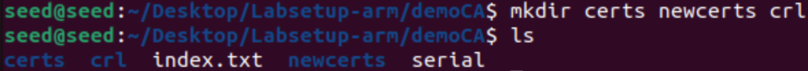

4. Executar o comando e preencher as informações relevantes: 

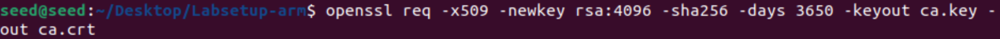

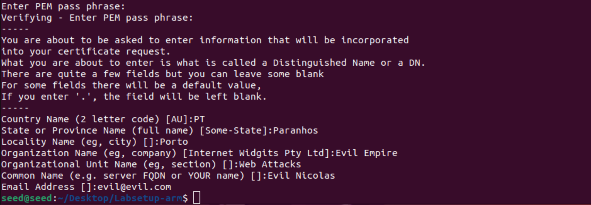

Após estes passos, nos registramos como uma *root* CA. Podemos verificar as informações relacionadas ao certificado:

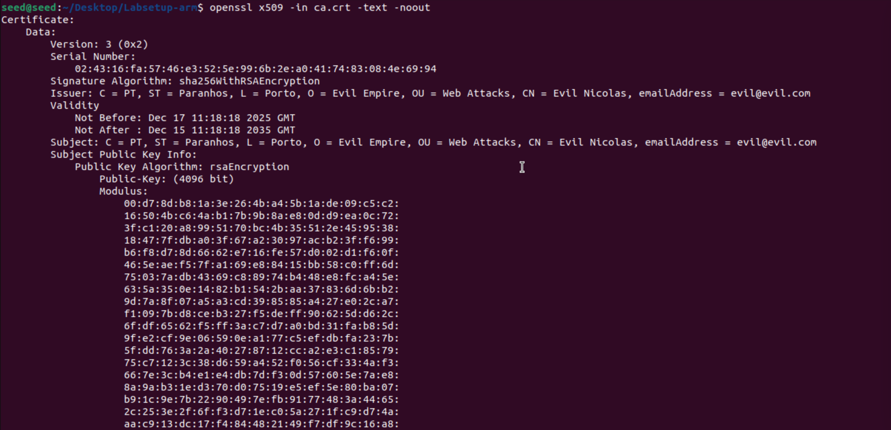
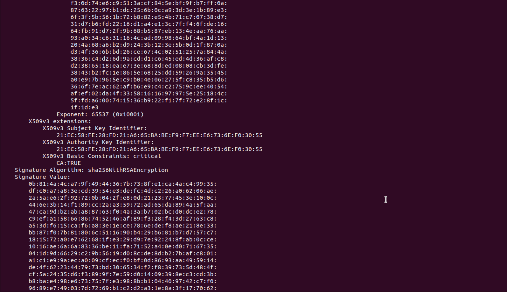
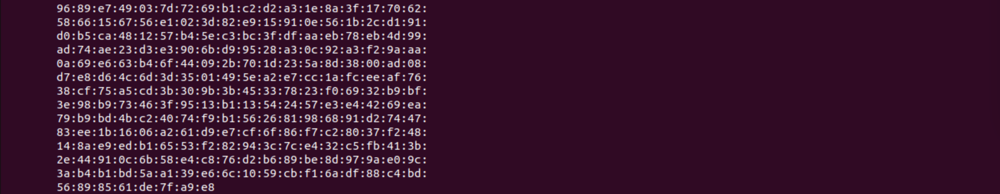

E informações relacionadas à chave:

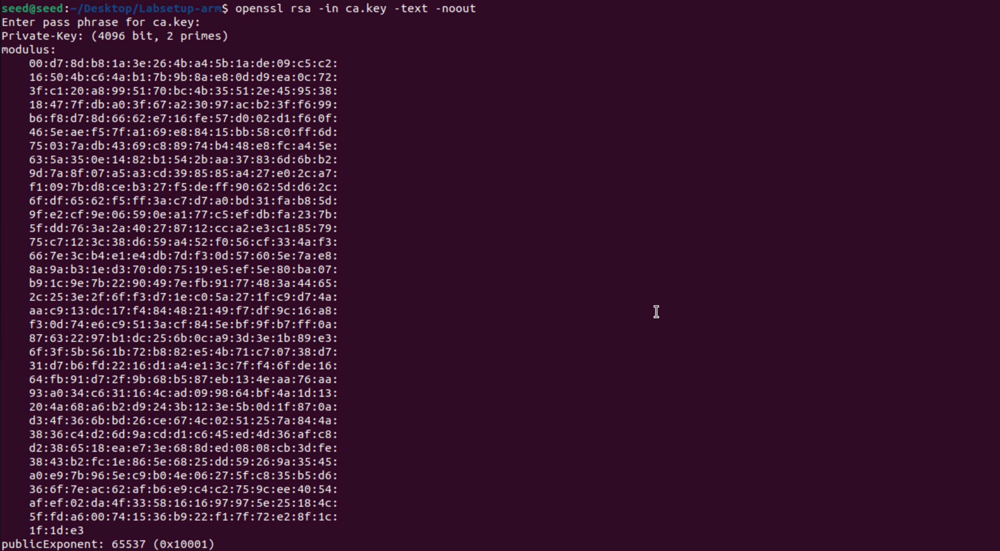
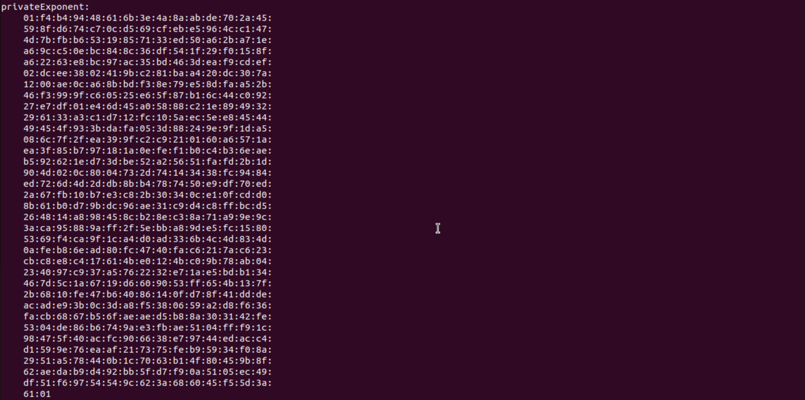
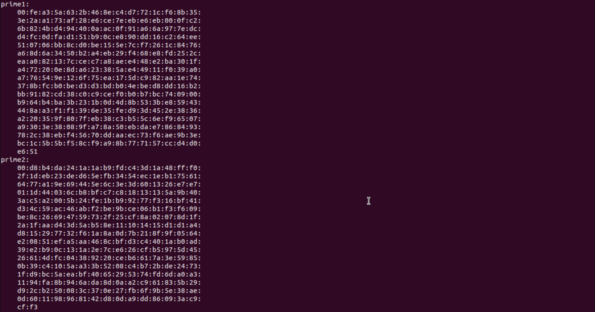
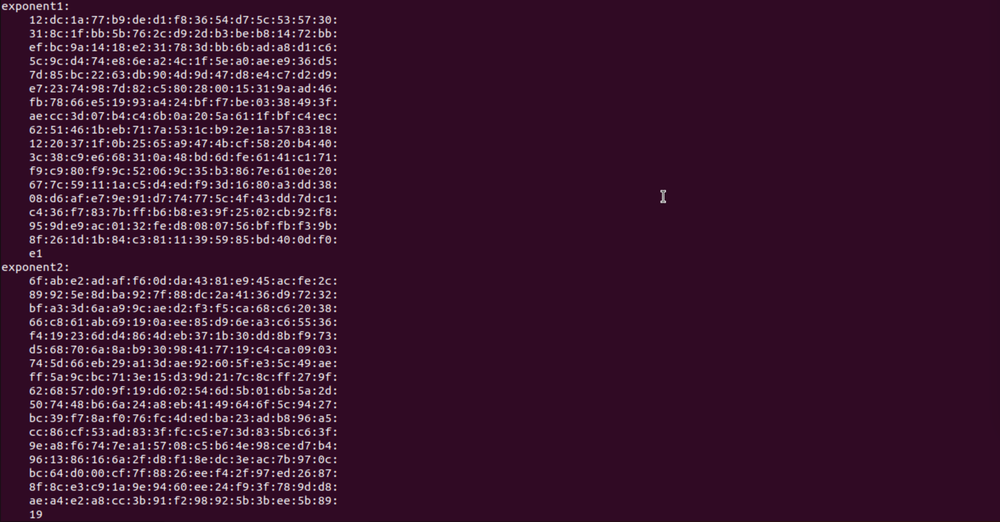
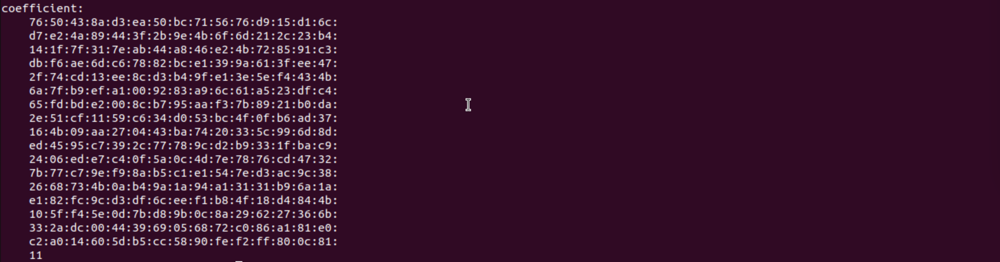

## Tarefa 2

Para a tarefa 2, vamos gerar um pedido de certificado para a *root* CA criada assinar e certificar um *web server*.
 
Executamos o seguinte comando:

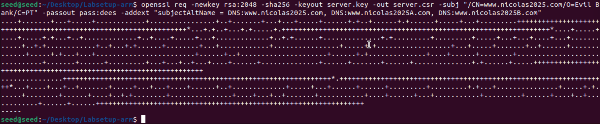

Podemos verificar a informação do pedido:

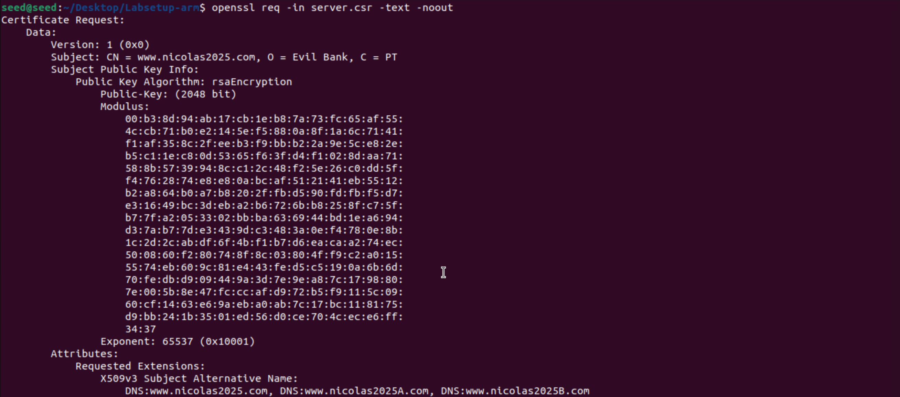
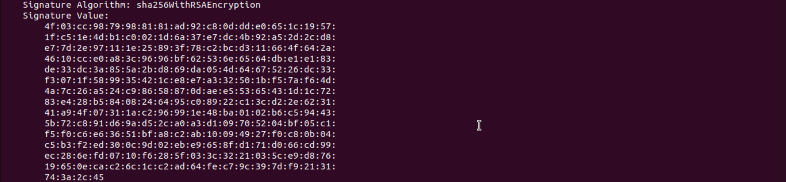

## Tarefa 3

Para a task 3, vamos aceitar o pedido gerado pelo *web server* com a *root* CA.

1. Descomentamos a linha "copy_extensions" do arquivo de configuração do *openssl*:

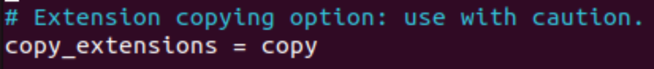

2. Corremos o comando para certificar o *web server*:

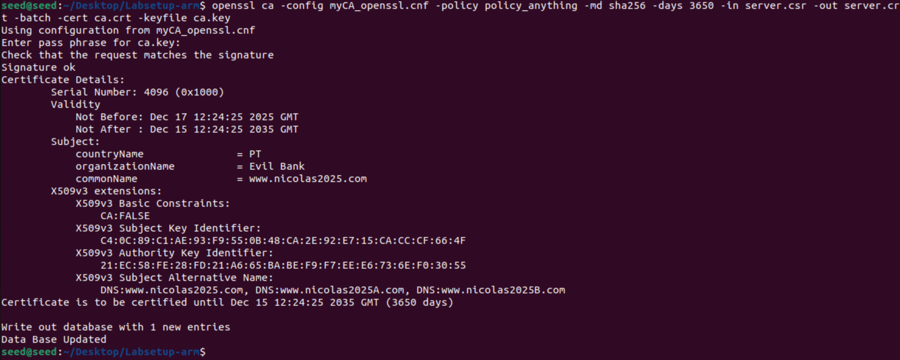

3. Checamos o estado do certificado:

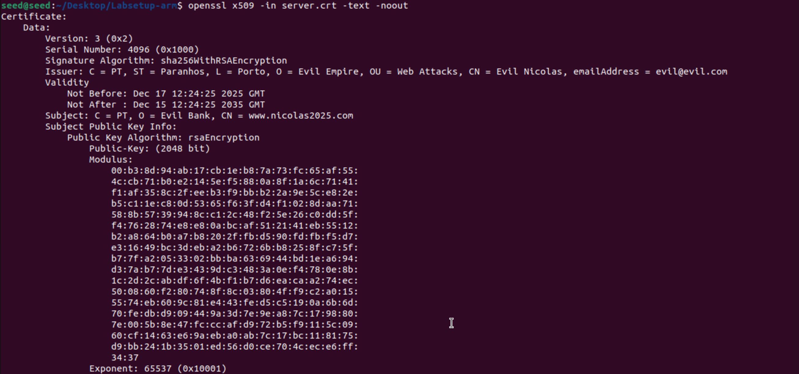
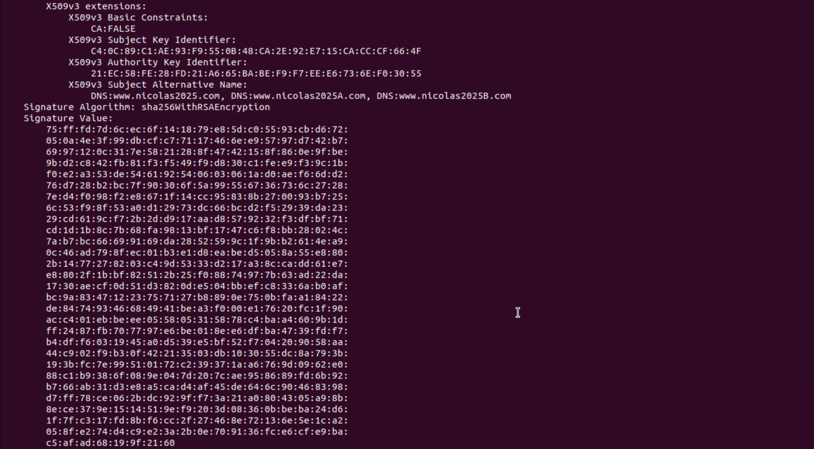

## Tarefa 4

## Tarefa 5

## Tarefa 6

