# Sniffing and Spoofing Lab

# Setup do Ambiente

Construimos e rodamos os containers Docker:

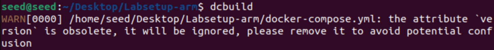
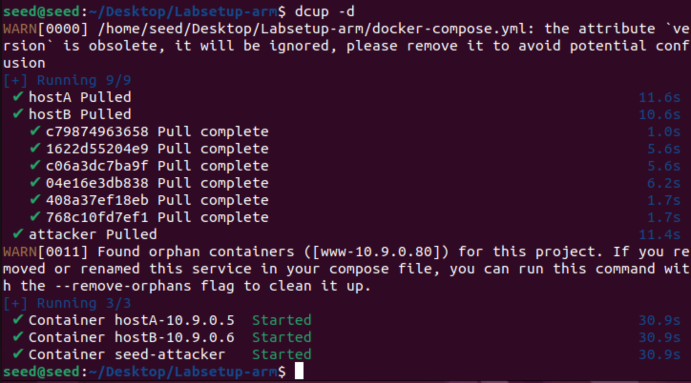

Identificamos o nome da interface de rede:

* Com ``` ifconfig ```:

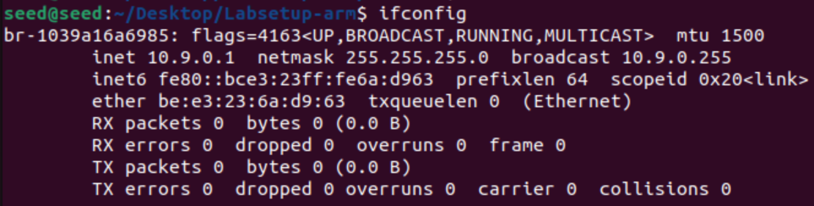

* Com ``` docker network ```:

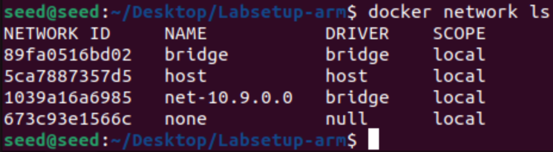

# Task Set 1

Para este conjunto de tarefas, utilizaremos o módulo Scapy, do python, para fazer *sniffing* e *spoofing* de pacotes.

## Task 1.1

### Task 1.1A

Nesta tarefa, testaremos o Scapy para analisar pacotes, com e sem privilégios de *root*.

* Com privilégios de *root*:

1. Criamos o arquivo python com o nome da interface de rede correta:

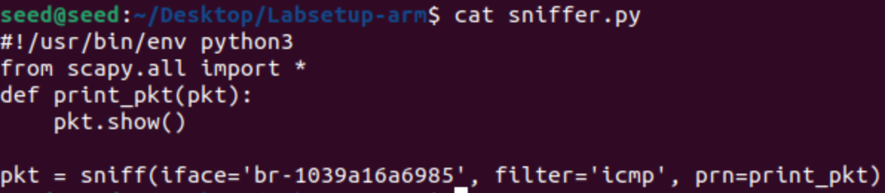

2. Executamos o código com privilégios de *root*:

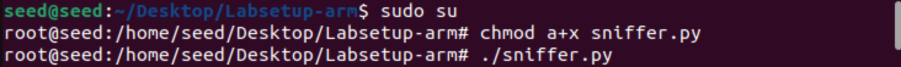

3. Em outro terminal, executamos o comando ```ping``` dentro de uma das máquinas rodando no container:

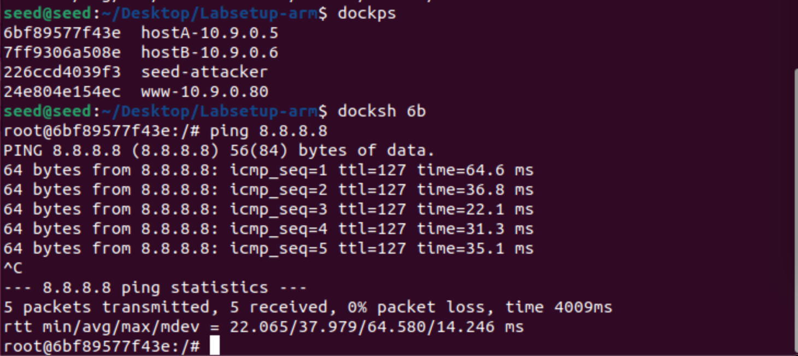

4. Verificamos que o programa funciona, capturando pacotes e devolvendo informações sobre eles:

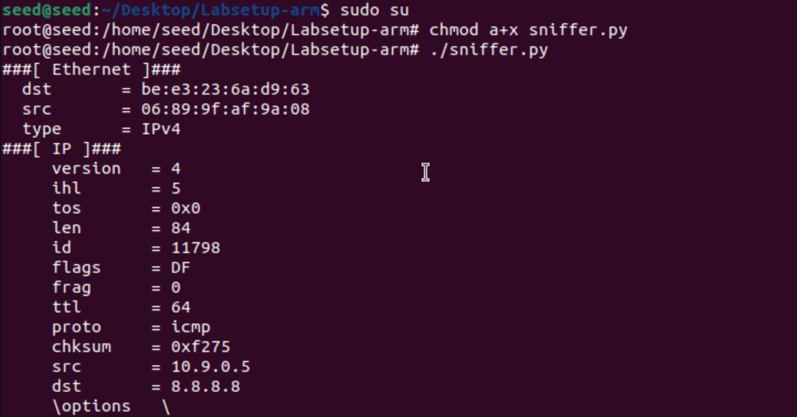
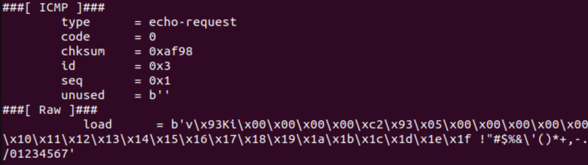

* Sem privilégios de *root*:

Ao tentar executar o programa, recebemos um erro de permissão:

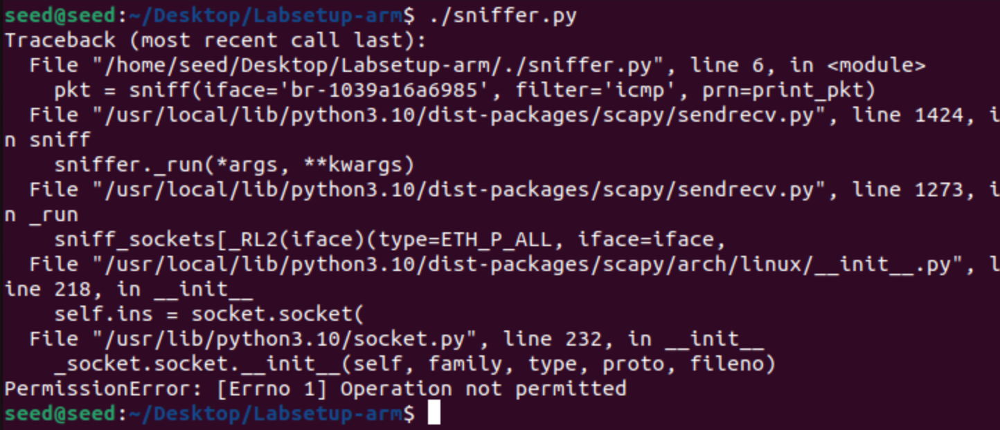

Não é possível executar o programa sem privilégios de *root*.

### Task 1.1B

Para esta tarefa, filtraremos os pacotes capturados pelo nosso programa utilizando o BPF (*Berkeley Packet Filter*).

* Capturar apenas pacotes ICMP:

Inicialmente, o programa já estava filtrando por pacotes ICMP:


Output:


* Capturar qualquer pacote TCP que tem origem num IP em particular com porta de destino número 23.

Programa (IP escolhido: 10.9.0.5):

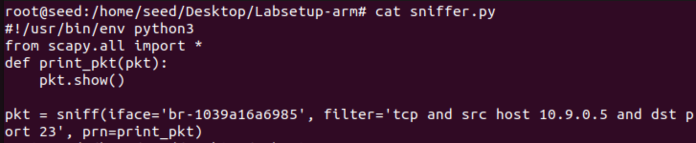

Geramos pacotes TCP numa das máquinas:

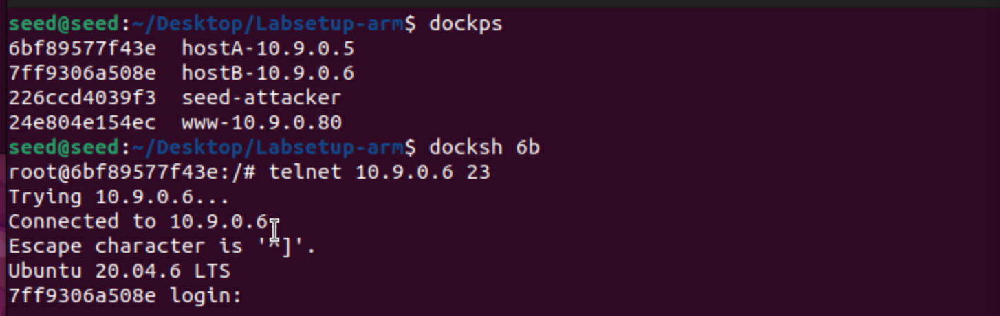

Output:

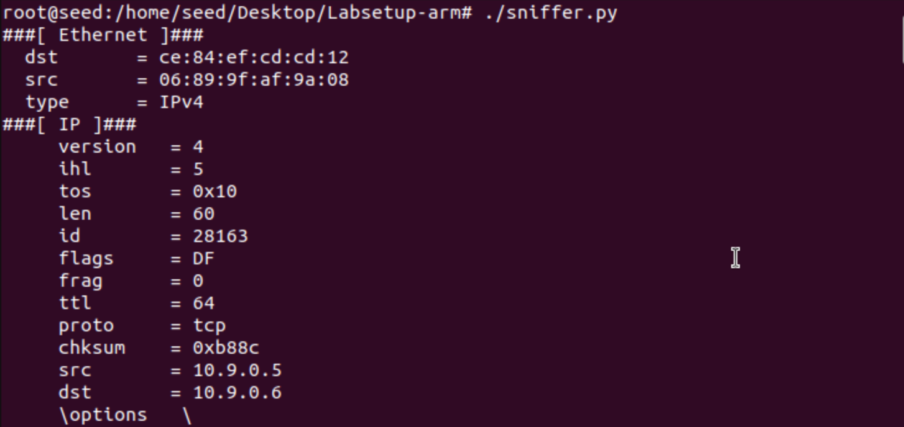
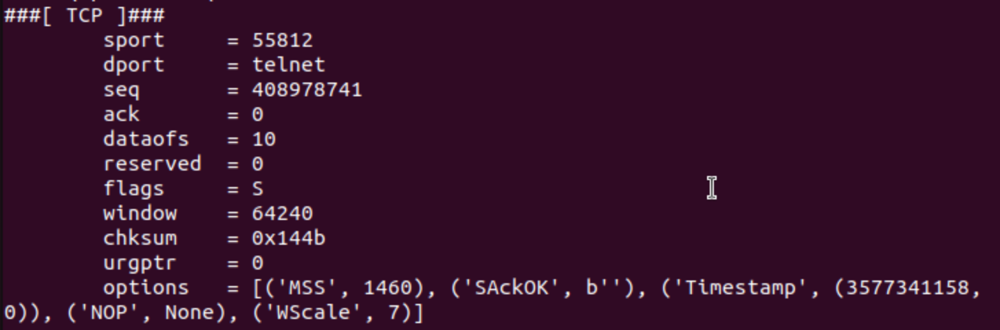

* Capturar pacotes que vem ou vão para uma subnet em particular:

Programa (Subnet escolhida: 128.230.0.0):

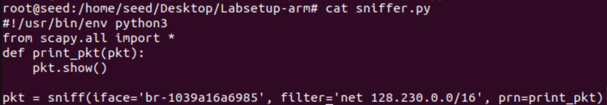

Ao dar ```ping``` a subnet 128.230.0.0, os pacotes são mostrados no output do programa:

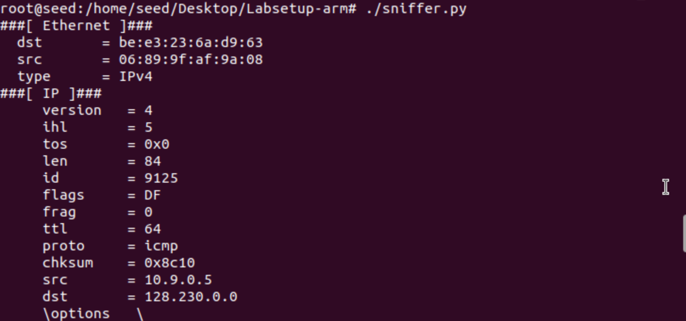
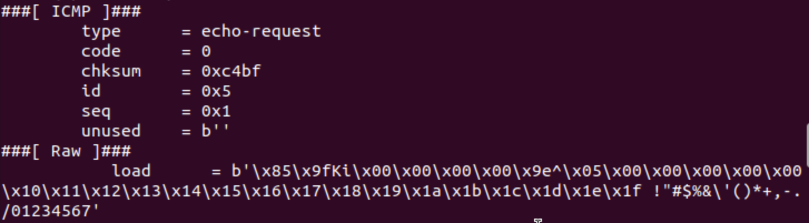

Se tentarmos dar ```ping``` à outra subnet, os pacotes não são mostrados:

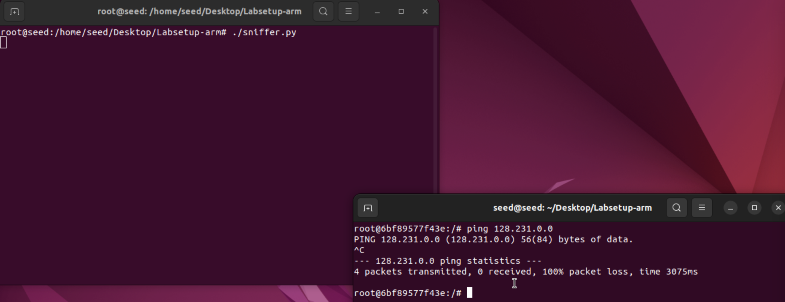

## Task 1.2

Para esta tarefa, enviaremos um pacote ICMP Echo Request de um IP de origem arbitrária para o host B (IP 10.9.0.6).

1. Modificamos ```sniffer.py``` de forma a que capture pacotes do tipo ICMP:

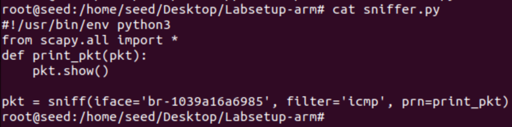

2. Criamos o programa ```spoofer.py```:

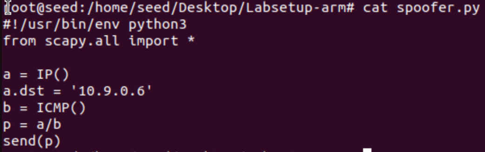

3. Executamos ```sniffer.py``` para preparar a captura dos pacotes.

4. Executamos ```spoofer.py``` para enviar o pacote:

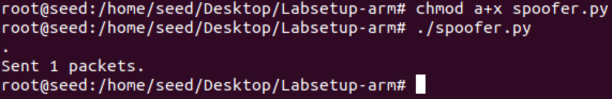

5. Verificamos o terminal onde está executando ```sniffer.py``` para verificar os pacotes:

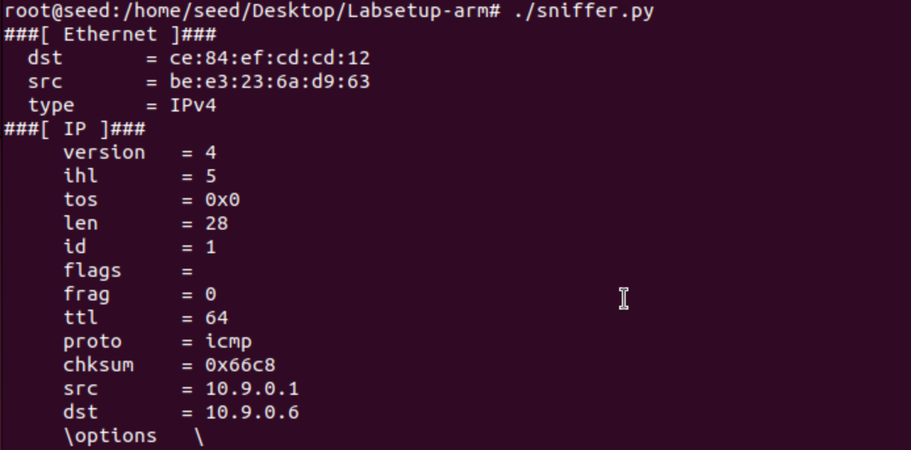
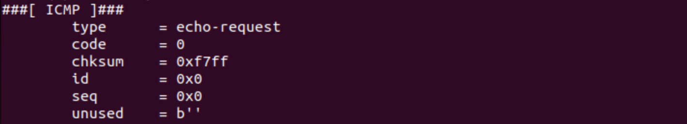
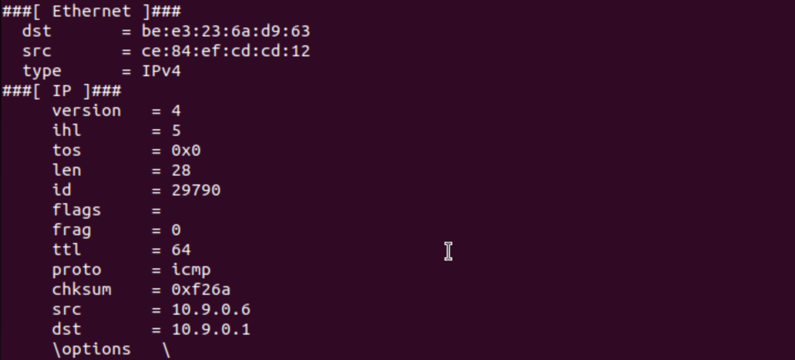
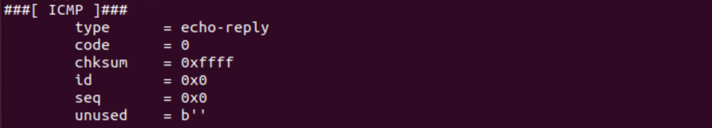

## Task 1.3

## Task 1.4