# Sniffing and Spoofing Lab

# Setup do Ambiente

Construimos e rodamos os containers Docker:


Identificamos o nome da interface de rede:

* Com ``` ifconfig ```:


* Com ``` docker network ```:


# Task Set 1

Para este conjunto de tarefas, utilizaremos o módulo Scapy, do python, para fazer *sniffing* e *spoofing* de pacotes.

## Task 1.1

### Task 1.1A

Nesta tarefa, testaremos o Scapy para analisar pacotes, com e sem privilégios de *root*.

* Com privilégios de *root*:

1. Criamos o arquivo python com o nome da interface de rede correta:


2. Executamos o código com privilégios de *root*:


3. Em outro terminal, executamos o comando ```ping``` dentro de uma das máquinas rodando no container:


4. Verificamos que o programa funciona, capturando pacotes e devolvendo informações sobre eles:


* Sem privilégios de *root*:

Ao tentar executar o programa, recebemos um erro de permissão:


Não é possível executar o programa sem privilégios de *root*.

#### Análise dos Pacotes Capturados

Os pacotes capturados são divididos em quatro campos: *Ethernet*, *IP*, Tipo de pacote, *RAW*.

O campo *Ethernet* mostra:
* Os endereços MAC de origem e destino do pacote.
* Protocolo encapsulado no pacote (neste caso, IPv4).

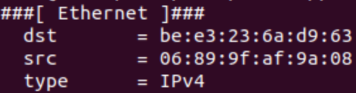

Nota: Este campo corresponde à camada de ligação de dados (*layer-2*). Dependendo do meio físico utilizado, este campo pode variar em nome e atributos (por exemplo, IEEE 802.11 em redes Wi-Fi).

O campo *IP* mostra:
* Informações sobre o pacote e seu conteúdo (len, chksum, id...).
* Tipo de pacote (campo *proto*, neste caso é um pacote ICMP)
* Endereços IP de origem e destino.

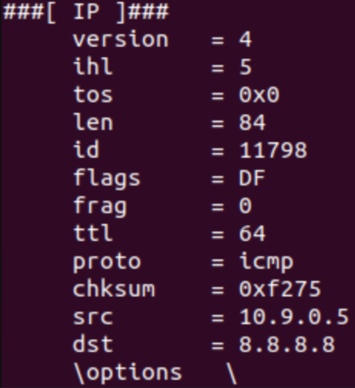

O terceiro campo representa o tipo de pacote (ICMP, TCP...). Neste caso temos um pacote ICMP, então temos:
* Informações sobre a categoria deste tipo de pacote (ICMP Echo Request, um ```ping```).
* Informação sobre a numeração e ordem do pacote, para associar os pedidos e respostas.

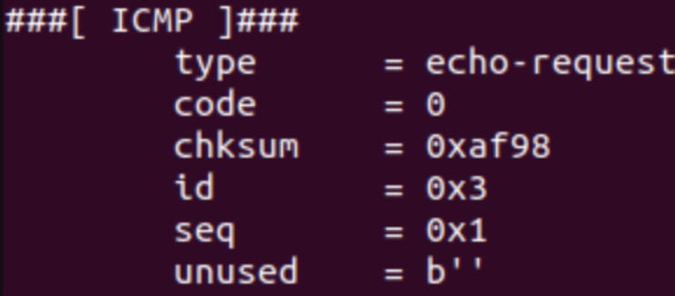

O campo *RAW* mostra o conteúdo do pacote:

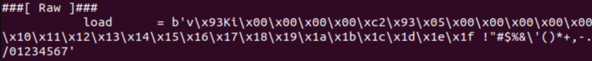

### Task 1.1B

Para esta tarefa, filtraremos os pacotes capturados pelo nosso programa utilizando o BPF (*Berkeley Packet Filter*).

* Capturar apenas pacotes ICMP:

Inicialmente, o programa já estava filtrando por pacotes ICMP:


Output:


* Capturar qualquer pacote TCP que tem origem num IP em particular com porta de destino número 23.

Programa (IP escolhido: 10.9.0.5):


Geramos pacotes TCP numa das máquinas:


Output:


* Capturar pacotes que vem ou vão para uma subnet em particular:

Programa (Subnet escolhida: 128.230.0.0):


Ao dar ```ping``` a subnet 128.230.0.0, os pacotes são mostrados no output do programa:


Se tentarmos dar ```ping``` à outra subnet, os pacotes não são mostrados:


## Task 1.2

Para esta tarefa, enviaremos um pacote ICMP Echo Request de um IP de origem arbitrária para o host B (IP 10.9.0.6).

1. Modificamos ```sniffer.py``` de forma a que capture pacotes do tipo ICMP:


2. Criamos o programa ```spoofer.py```:


3. Executamos ```sniffer.py``` para preparar a captura dos pacotes.

4. Executamos ```spoofer.py``` para enviar o pacote:


5. Verificamos o terminal onde está executando ```sniffer.py``` para verificar os pacotes:


## Task 1.3

O objectivo nesta task é descobrir o número de hops que um pacote atravessa da nossa VM até um destino. 

1. Para isso, começamos por definir um destino externo face ao qual vamos fazer esta medição. Nós escolhemos o destino com IP 8.8.8.8.

2. De seguida, montamos o seguinte script em Python (```trace.py```) para automatizar essa contagem:

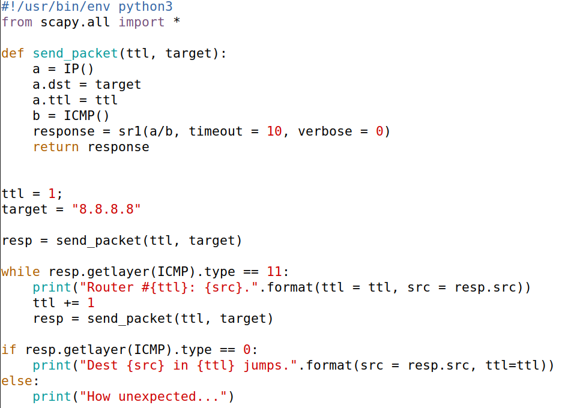

Neste script, a função send_packet é responsável por criar o pacote a enviar para o destino (definindo o destino em "a.dst") e por receber a resposta a esse pedido que pode ser do tipo 11 (que nos indica que o TTL (*time to live*) foi excedido) ou 0 (que indica que o pacote chegou ao destino).

De seguida, inicializamos o TTL a 1, para que possamos descobrir o router que recebe primeiro o pacote (1º *hop*), definimos o IP de destino e enviamos o primeiro pacote. Após este passo, o script executa um *while loop* responsável por enviar mais mensagens e mostrar no terminal o router no qual esse pacote atingiu o TTL (com base no conteúdo da resposta) e, assim, mapear o percurso até ao destino. Quando o script recebe uma resposta que não seja do tipo 11, o loop termina e, caso a resposta tenha sido do tipo 0, quer dizer que chegamos ao endereço de destino, que é imprimido no terminal junto com o número de saltos (hops ou jumps). 

3. Executamos ```trace.py```:

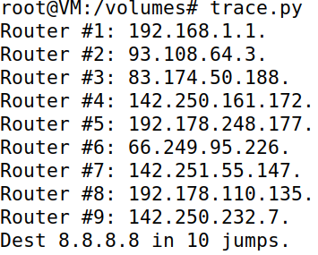

Com base no output, conseguimos verificar que precisamos de 10 saltos para alcançar a máquina de destino com o IP 8.8.8.8.

## Task 1.4

Nesta task, o objetivo é desenvolver um script que leia pacotes ICMP *echo request* que passem na LAN e envie um pacote *echo reply* **spoofed** em nome do destino original, quer este exista quer não, de maneira a que o recetor pense que o destino existe.

Para isso, criamos o seguinte script:

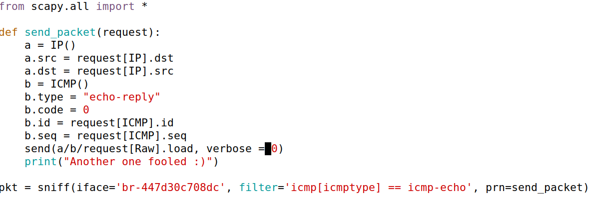

Este script deteta pacotes ICMP *echo request* na LAN e cria uma resposta ICMP *echo reply*. Para a resposta, ele troca o "src" e o "dst" com os do pacote detetado e copia os campos "id", "seq" (ICMP) e "load" (RAW) para a resposta. O script define também o tipo e código da resposta para coincidir com uma mensagem do tipo *echo reply*. Depois, envia a nova mensagem. Nos screenshots a seguir, conseguimos ver o script em funcionamento quando enviamos um ping para o endereço IP inexistente 1.2.3.4.

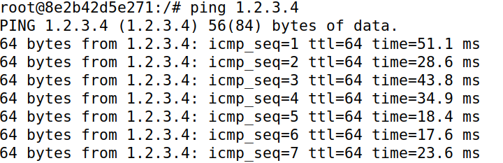
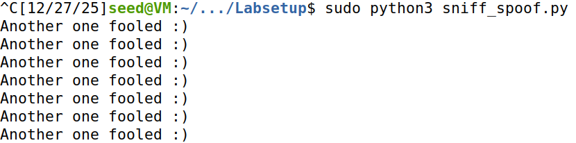

Se, nos pacotes de resposta removermos o atributo "id", o ping falha, assim como se comentarmos o atributo "load". Isto acontece porque o destinatário vai descartar a resposta não a associando ao pedido, pelo que o nosso objetivo não é concluído:

#### ID

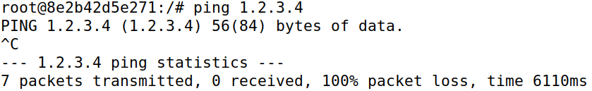

#### Load
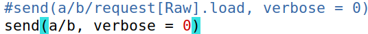
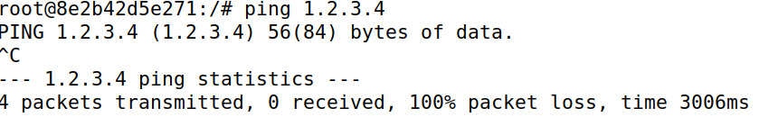

#### Seq
No entanto, removendo o atributo "seq", o ping funciona, com o detalhe que todas as respostas após a primeira, serão marcadas como duplicadas.


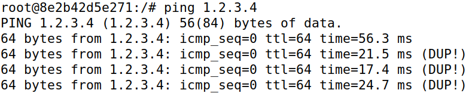

### Pings

Fazendo ping para os 3 endereços referidos no guião (1.2.3.4, 10.9.0.99, 8.8.8.8) obtemos os seguintes resultados (assim como os respetivos comandos **ip route get**):

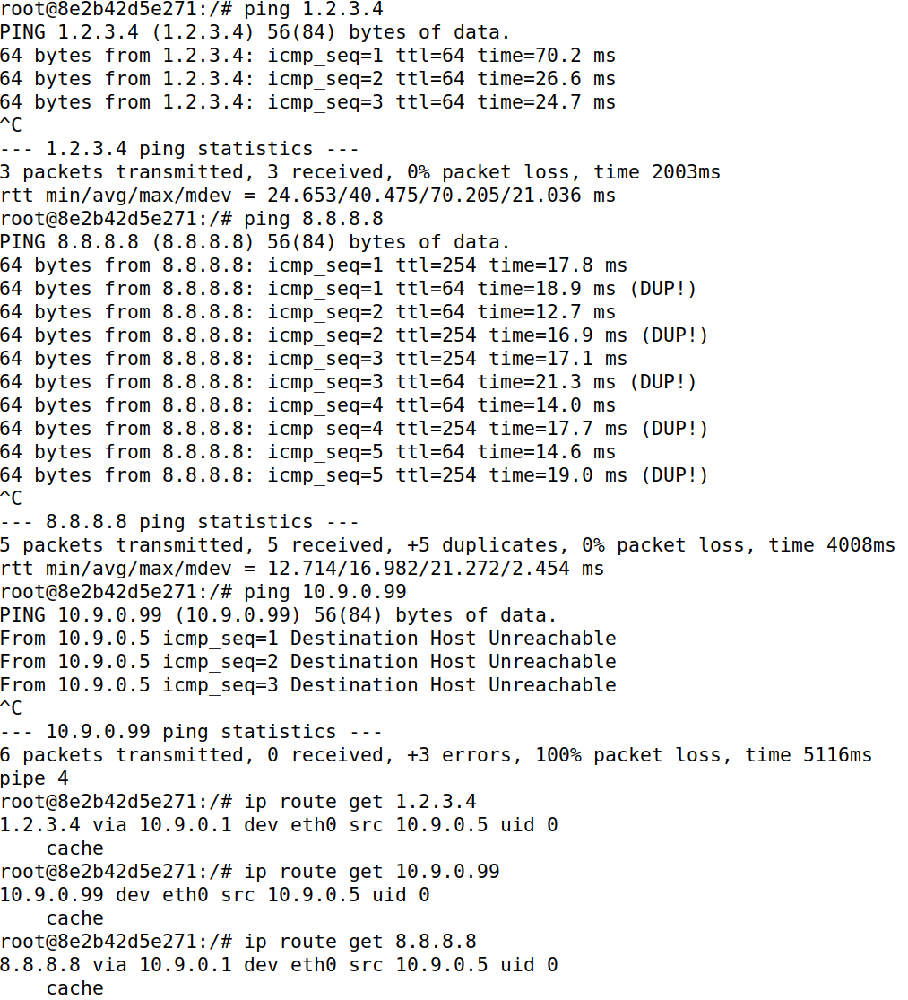

É importante notar que a VM faz parte da subnet 10.9.0.0/26, o que implica que esta consiga comunicar diretamente com as máquinas entre os endereços 10.9.0.0 e 10.9.0.255 (*broadcast*).
Outro fator importante é o protocolo ARP, responsável pela tradução de endereços IP em endereços MAC, permitindo a transferência de um pacote de uma máquina para uma máquina "adjacente" (*hops*).

#### Ping 1.2.3.4

Este endereço de IP não existe, mas também não faz parte da subnet onde o container se encontra. Sendo assim, e com base no resultado do comando **ip route get 1.2.3.4**, o pacote é enviado para a gateway 10.9.0.1 e respetivo endereço MAC. Deste modo, e como foi transmitido na LAN, o nosso script de sniffing e spoofing consegue detetar esse pacote e forjar uma resposta, levando o container a pensar que o endereço IP 1.2.3.4 pertence a alguma máquina fora da LAN, sendo, assim, enganado pelo script.

#### Ping 8.8.8.8

Este endereço IP existe e não faz parte da subnet onde o container se encontra. Sendo assim e, similarmente à situação anterior, o pacote é enviado para a gateway 10.9.0.1 e, como foi transmitido na LAN, o nosso script detetou-o e enviou uma resposta que foi recebida pelo container. No entanto, ao contrário do caso anterior, este endereço está atribuido e, como tal, o seu recetor esperado também envia uma resposta pelo que o container receberá duas respotas para o mesmo pacote e marcará o segundo a chegar como duplicado (isto pode ser também verificado pela presença de dois TTLs diferentes, 64 (forjado) e 254 (legítimo)).

#### Ping 10.9.0.99

Este endereço IP não existe, no entanto, faz parte da mesma subnet do container, como tal, o container deveria conseguir enviar o pacote diretamente para a máquina de destino (daí o comando **ip route get 10.9.0.99** não indicar nenhuma gateway, ao contrário dos casos anteriores) e, como tal, lança um ARP request para descobrir a que endereço MAC este IP pertence. No entanto, como este IP não foi atribuido, nunca chegará uma resposta a este pedido e, como tal, o pacote ICMP *echo request* não chega a ser enviado na LAN, pelo que o nosso script nunca o chega a detetar. Como tal, o resultado de um ```ping``` a este endereço IP é um "Destination Host Unreachable", como observado no *screenshot* acima.