# **Buffer-Overflow Attack Lab - Set-UID Version**

## **Questão 1**

Começou-se por desabilitar o Address Space Randomization e mudar a shell de “dash” para “zsh”, shell esta, vulnerável a ataques relacionados com o SetUID.

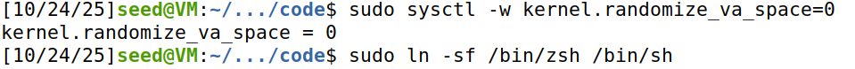

A seguir, compilou-se e executaram-se os shell codes de 32-bit e 64-bit e nenhuma diferença aparente foi identificada na sua execução. A única diferença observada limita-se às instruções do shellcode em si, que variam devido às diferenças entre as arquiteturas.

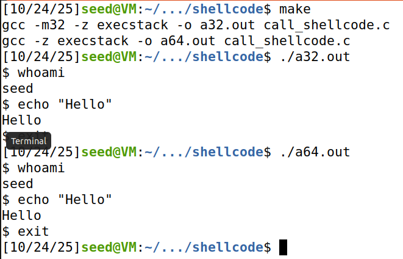

Na Task 2, criamos o “badfile”, alterámos o valor L1 na Makefile, como pedido, para 108 (100 + 8 * G, em que G = 1) e compilamos com make stack-L1 (o que tornout, também stack-L1 num SetUID, mas não stack-L1-dbg, detalhe este que será relevante mais à frente).

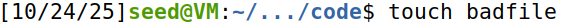

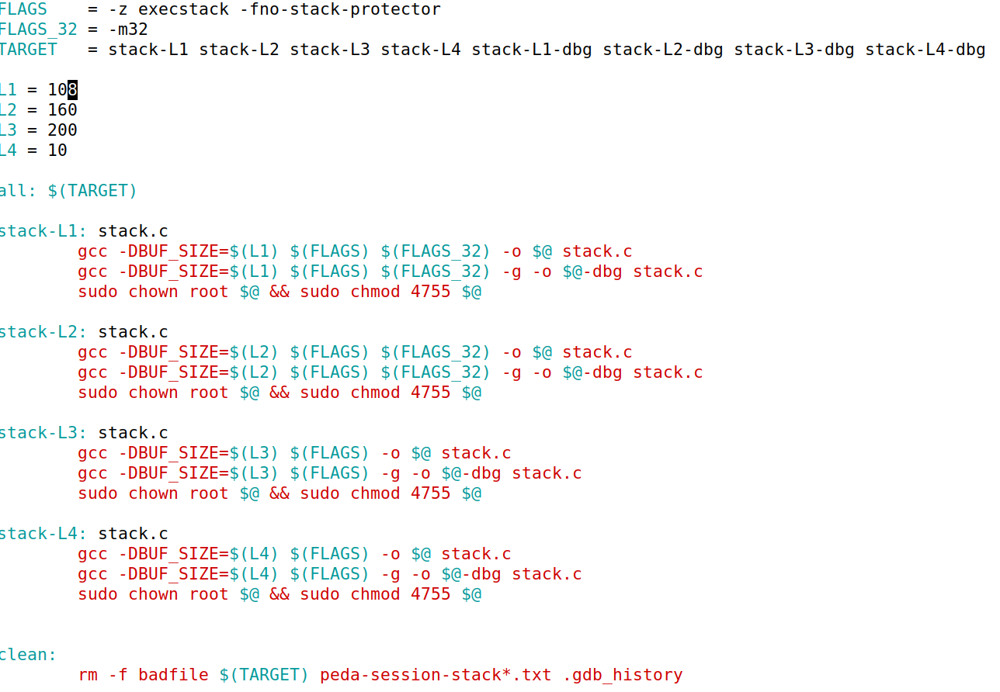

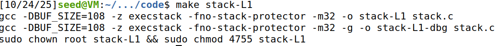

De seguida, executamos stack-L1-dbg em debug mode com o GDB e, seguindo o exposto no guião #5 presente no Moodle, fizemos com que os endereços de stack-L1-dbg dentro do GDB fossem os mesmos que os fora dele:

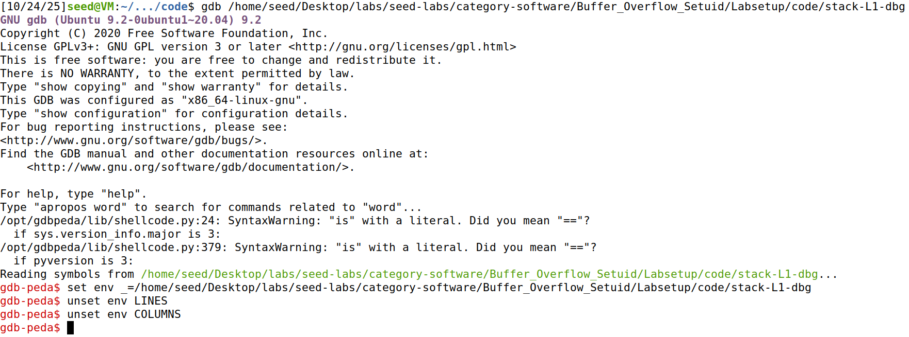

Definimos a função bof como o breakpoint:

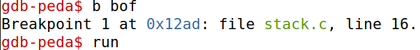

Executamos o programa com "run" e, de seguida, corremos o comando "next" para que o registo ebp (frame pointer) fosse atualizado para o valor do início do stack frame dedicado de bop:

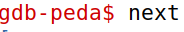

Agora, é importante descobrir os valores de ebp e de buffer, uma vez que, para conseguirmos executar propriamente o exploit, será necessário chegar ao return address posicionado acima do frame pointer anterior que se encontra, por sua vez, imediatamente acima do stack frame do bop. Ora, isto que dizer que, para reescrevermos o return address com o valor pretendido, temos de o colocar na posição (offset buffer-ebp) + 4, uma vez que correponderá à distância entre a primeira posição do buffer e o início do stack frame  mais os 4 bytes necessários para ultrapassar o frame pointer anterior e chegar ao return address.

Para isso, executamos os seguintes comandos no gdb e obtivemos os respetivos valores:

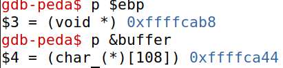

Com estes valores podemos obter o seu offset: 0x76 = 116.

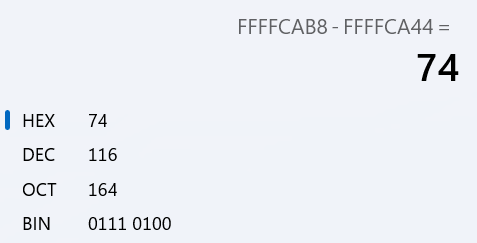

Sendo assim, temos o que precisarmos para tentarmos criar o nosso exploit. O exploit, cujo esqueleto se encontra em exploit.py, insere no ficheiro "badfile" texto com um tamanho de 517 e, como o buffer em bof só está capacitado a receber 108 chars (bytes), haverá um buffer overflow.
1. O offset do return address deverá ser, como indicado anteriormente, de 116 + 4, ou seja, 120.
2. O shellcode foi copiado diretamente do shellcode de 32-bit fornecido na Task 1.
3. O offset do shellcode, com base nos slides da aula teórica, deve estar posicionado acimado return address e, como tal, arbitrariamente, atribuímo-lhe o offset de 300. Isto é representado pela imagem abaixo retira dos slides da aula teórica ("Software Security (Part 1)")

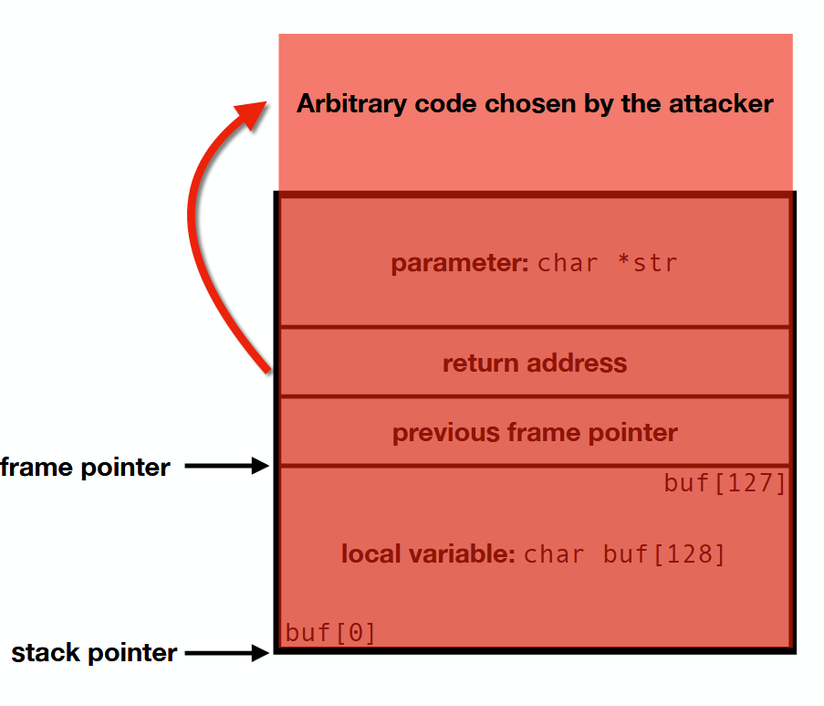

4. Quanto ao return address, como o shellcode se encontra acima do return address e para evitar que o programa tentasse executar alguma sequência de bits que não NOPs ou o shellcode, o que resultaria no risco de o programa falhar, atribuímo-lhe o endereço de ebp mais um offset (0xffffcab8 + 100), relativamente arbitrário, de modo a que o resultado seja superior à posição do return address, mas inferior ao do shellcode. Tentar atribuir um offset preciso, ou seja, diretamente para o shellcode é desnecessário, por causa da presença dos NOPs e propenso a falhas, pois, como se verá a seguir, quando o valor dos endereços da stack variam, o exploit deixa de funcionar (tentativas de apontar diretamente para o shellcode serão apresentadas no fundo do relatório).

Terminamos com o seguinte exploit.py: 

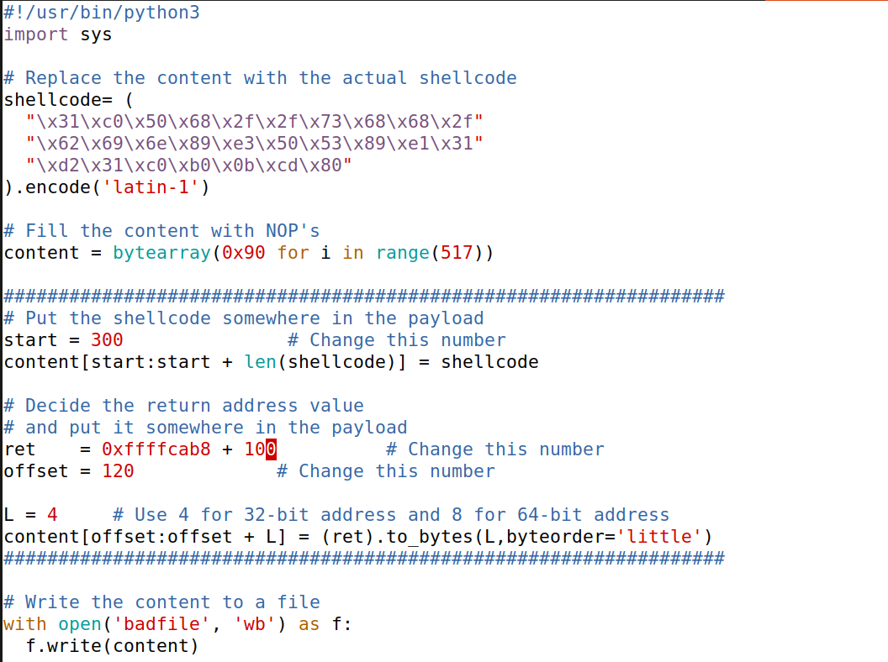

Depois, corremos o exploit.py, para que este alterasse o "badfile".

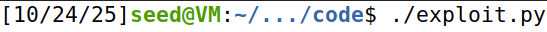

Para confirmar se o exploit realmente funciona, voltamos a executar stack-L1-dbg (de maneira a que os endereços dentro e fora da stack no GDB sejam os mesmos) no GDB e tivemos sucesso: uma shell foi iniciada. No entanto, é uma shell normal, uma vez que, como referido anteriormente, este programa não foi definido como SetUID.

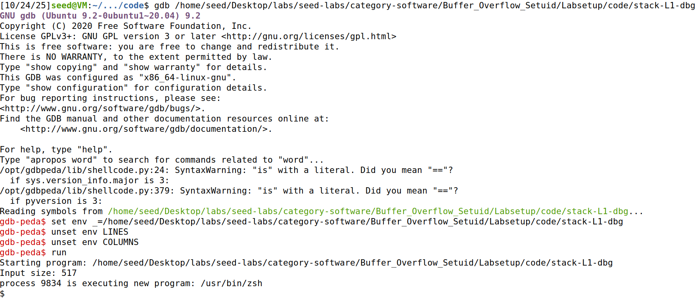

Executando stack-L1-dbg como "/home/seed/Desktop/labs/seed-labs/category-software/Buffer_Overflow_Setuid/Labsetup/code/stack-L1" fora do GDB, podemos verificar que o exploit funcionou novamente, mas, mais uma vez, é uma shell normal pelo motivo acima referido.

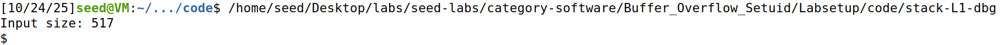

Se agora tentarmos executar o programa stack-L1 da seguinte forma: "/home/seed/Desktop/labs/seed-labs/category-software/Buffer_Overflow_Setuid/Labsetup/code/stack-L1", isto é, o mesmo programa mas compilado sem a flag de debugging, mas o qual foi definido como SetUID pela Makefile, vemos que o exploit funciona e, desta vez, obtivemos realmente uma "root shell".

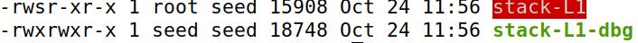

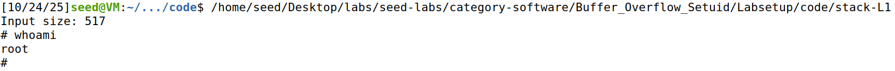

No entanto, se tentarmos executar como ./stack-L1, o programa falha com "Segmentation Fault". Isto deve-se ao facto de, por exemplo argv[0] ser menor, logo os endereços são diferentes e o return address foi dar a resultar nalgum endereço inválido (ou porque o programa executou NOPs até chegar a bytes que não correspondem a instruções válidas, ou porque o return address apontava diretamente para um desses bytes). 

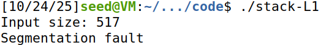

Como o tamnho de argv[0] diminui, é provável que os endereços da stack estejam acima do esperado. Sendo ssim, aumentamos o return address para "+ 200", mas, mesmo assim, o programa falhou, novamente, com "Segmentation Fault"

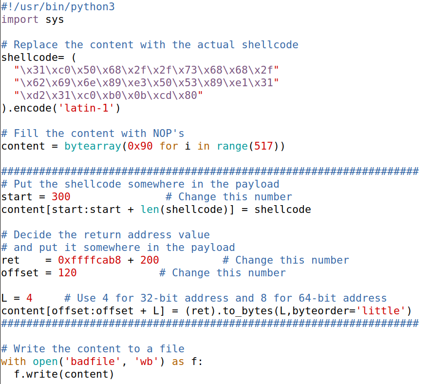

Tentamos novamente aumentar o return address, desta vez, para "+ 300" e, desta vez, o exploit funcionou, pois o programa deu-nos uma "root shell".

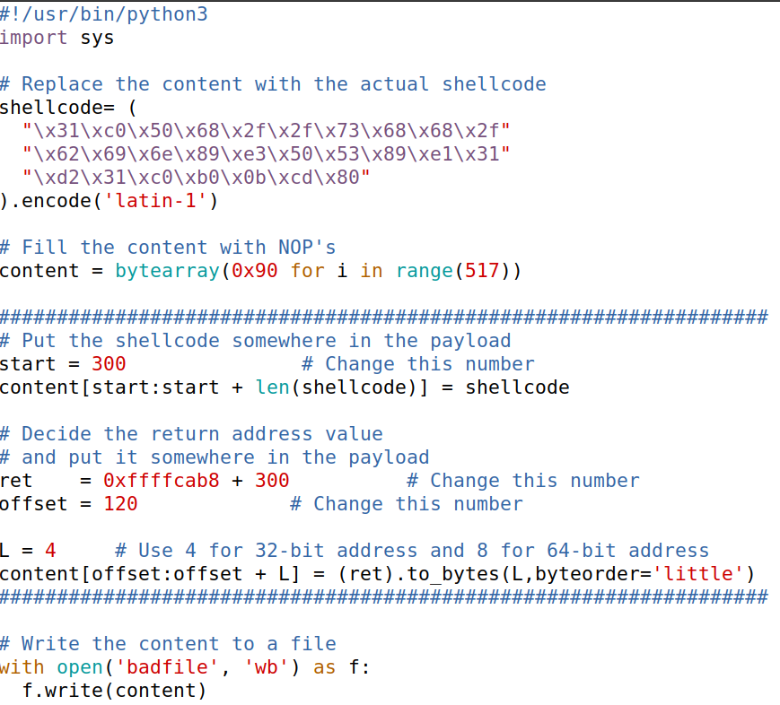

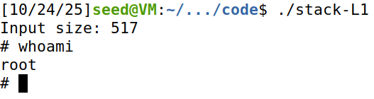

## **Questão 2**

Para esta questão, utilizaremos o exploit.py em que o return address corresponde a 0xffffcab8 + 100 (o exploit.py inicial), uma vez que o programa utilizado será stack-L1-dbg. Faremos também com que os endereços no GDB correspondam aos que seriam fora do GDB.

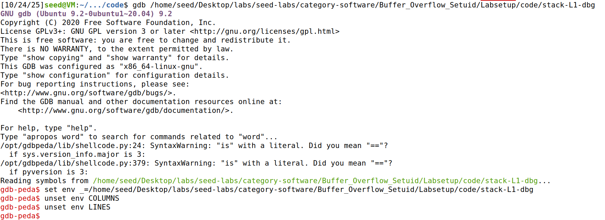

De seguida, define-se bof como o breakpoint e executa-se o programa com "run":

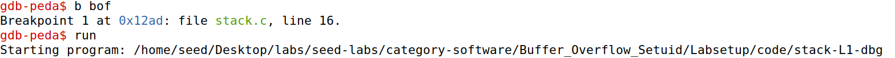

E corre-se o comando "next" duas vezes, isto é, após a execução do strcpy e depois de se dar o overflow:

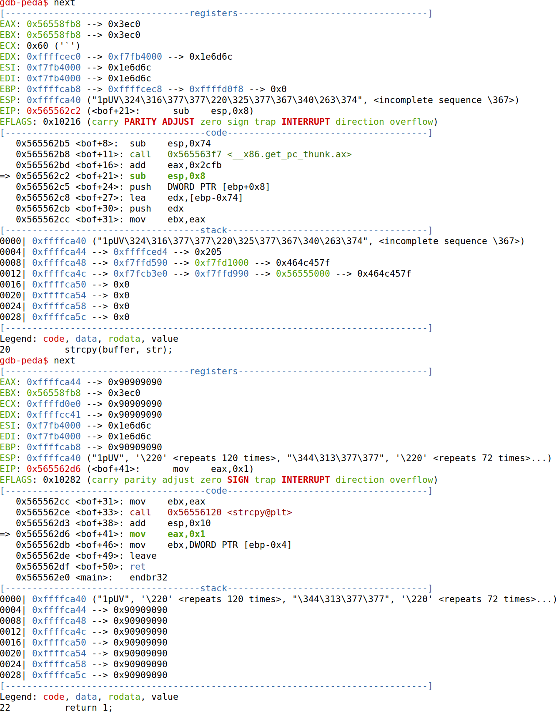

A imagem abaixo corresponde aos 85 primeiros endereços de 32 bits:

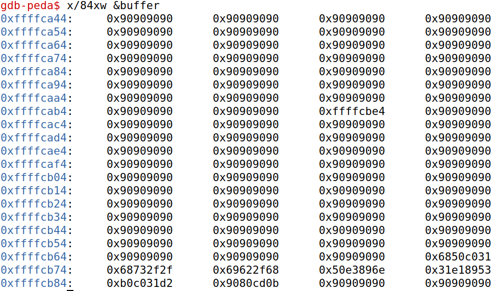

E, abaixo, podemos verificar que o shellcode começa a partir do endereço 0xffffcb70 e o return address encontra-se no endereço 0xffffcabc (0xffffcab8 + 4 tal como o esperado).

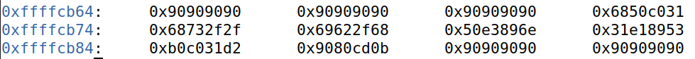
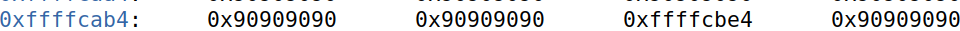

