# **Format-String Vulnerability Lab**

## Setup do Ambiente

Começou-se por desabilitar o Address Space Layout Randomization, como indicado no guião:

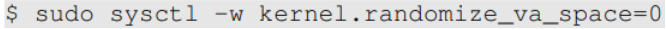

Ao executar o comando make dentro da pasta "server-code", o arquivo vulnerável "format.c" é compilado. Esse arquivo contém uma vulnerabilidade do tipo *format string*.

Durante a compilação, o compilador emite um aviso indicando uma potencial falha de segurança relacionada ao uso da função "printf" dentro da função vulnerável "myprintf", evidenciando o risco associado a essa implementação.

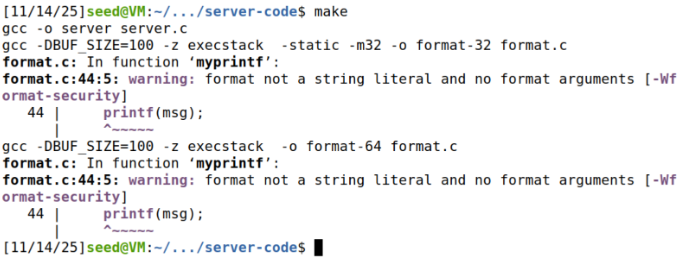

Também é importante observar que o arquivo é compilado com a *flag* "-z execstack", a qual torna a stack executável. Essa configuração intencionalmente enfraquece as medidas de segurança padrão, permitindo a execução de código injetado na pilha e viabilizando o sucesso do ataque. Em seguida, o comando "make install" envia os arquivos para a pasta "fmt-containers", para que os containers possam utilizá-lo.

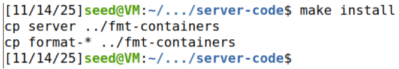

O arquivo "server.c" presente nesta pasta atua como ponto de entrada principal do servidor. Sempre que uma conexão TCP é estabelecida, o servidor invoca o programa "format", configurando essa conexão como a entrada padrão (stdin) do processo.

A seguir, foram utilizadas as aliases providenciadas no guião para facilitar o setup dos containers:

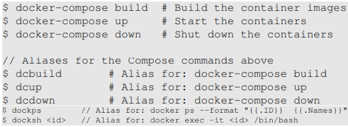

- Construção:

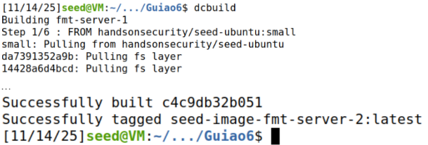

- Iniciação dos containers, num terminal à parte para possibilitar a leitura dos logs:

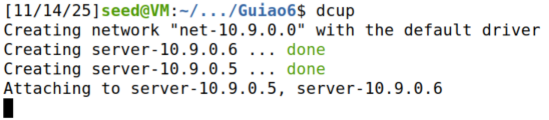

## **Questão 1**

### **Task 1: Crashing the Program**

Primeiro testamos a conexão através de uma mensagem benigna simples:

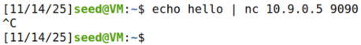

No terminal com o container docker executando obtemos o input e outras informações de endereços:

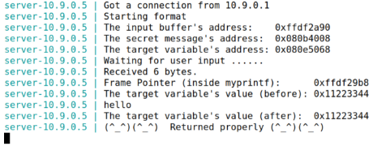

Utilizando o script "build_string.py" fornecido no diretório "attack-code", construímos um *payload* destinado a provocar o *crash* do programa, que é o encerramento da execução após a falha do mesmo.

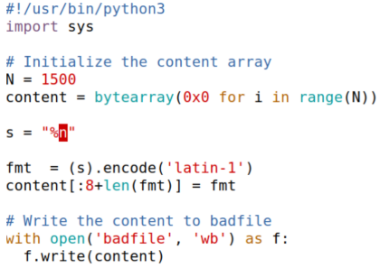

Esse *payload* funciona porque a string "%n" enviada ao programa faz com que "printf" interprete um valor presente na stack como um ponteiro e tente escrever nele o número de bytes já impressos — que, neste caso, é 0, já que não foi definido outro output além desse.

Se o endereço escolhido na pilha for inválido (por exemplo, não mapeado, protegido ou somente leitura), a tentativa de escrita falha e o programa sofre um "crash".

Isso implica que o *payload* pode não causar o "crash" na primeira execução, já que o endereço interpretado por "%n" pode, ocasionalmente, apontar para um endereço válido.

Em seguida, enviamos o arquivo "badfile" contendo o *payload* malicioso:

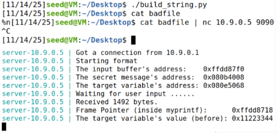

Na imagem acima, podemos ver o input utilizado no primeiro terminal (mais acima), seguido do output recebido do servidor (mais abaixo).

Podemos verificar que o programa encerrou sua execução em falha, já que não existem mais logs após o valor inicial da variável "target", numa execução normal, o output de "myprintf" aparecia logo após essa linha.

### **Task 2: Printing Out the Server Program’s Memory**

#### **2.A: read Stack Data**

Para essa task, foi construído o seguinte *payload*:

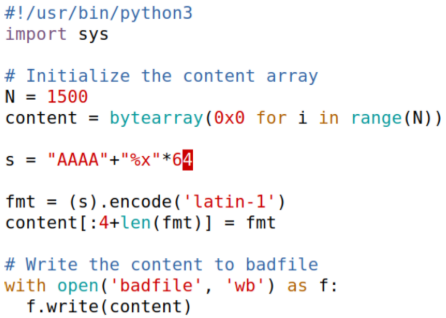

Este *payload* envia "AAAA" e "%x" 64 vezes. "%x" mostra o valor presente no endereço, em hexadecimal, como uma string.

Enviando o mesmo para o servidor, obtemos:

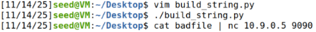

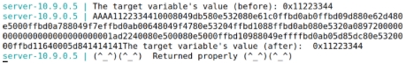

No endereço "target + 64", é possível observar o nosso input — "AAAA", representado em memória como "41414141".

O valor 64 foi determinado por meio de um processo de iteração: inicialmente utilizou‑se o valor 100, verificando se o input aparecia no output do servidor. A partir daí, o valor foi sendo ajustado de forma progressiva até que o input passasse a surgir na última posição exibida, identificando o deslocamento exato correto.

Com isso, é possível concluir que o número requerido de "%x" para alcançar o endereço do buffer de input é 64.

#### **2.B: read Heap Data**

Para a task 2.B, foi construído o seguinte *payload*:

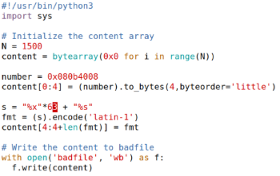

Sabendo que o endereço do input está a 64 endereços de distância do endereço de "target", inserimos o endereço da *secret message* diretamente no nosso *payload*, como o input.

Em seguida, utilizamos 63 especificadores "%x" para descartar os valores intermediários irrelevantes na stack e, finalmente, exibimos o conteúdo do endereço dado no input utilizando "%s".

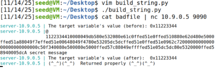

Ao enviar o *payload*, obtivemos o conteúdo da secret message, que é "A secret message".

### **Task 3: Modifying the Server Program’s Memory**

#### **3.A: Change the value to a different value**

Para a task 3.A, foi escolhido o seguinte *payload*:

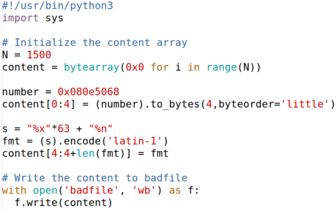

Utilizaremos a mesma lógica da *task* 2.B; a diferença sendo o facto de que, dessa vez, ao invés de ler o valor do endereço de input, que neste caso será o de "target", alteramos o valor do mesmo com "%n": o número total de bytes lidos do "printf" até aquele ponto.

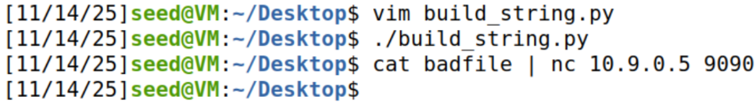

Ao enviar o *payload*, é possível observar que o *payload* foi bem sucedido: o valor da variável "target" foi modificado:

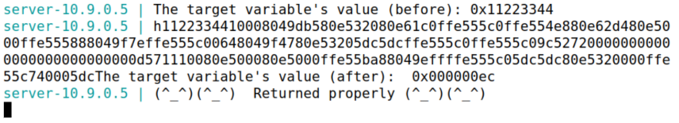

#### **3.B: Change the value to 0x5000**

O valor 0x5000 corresponde a 20480 em decimal. Ou seja, podemos utilizar "%n" se imprimirmos exatamente 20480 bytes antes de utilizar o mesmo. Isso é possível utilizando "%c" para imprimir um determinado número de caracteres com "printf".
Porém, antes disso, é necessário enviar o endereço como input no início e deslocar "%n" para a posição do endereço de input para colocar o valor no lugar certo.

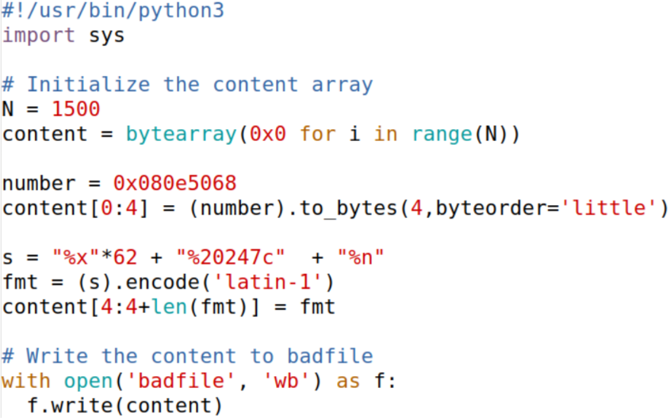

Numa situação perfeita, todos os valores impressos por "%x" têm exatamente 8 bytes. Porém, nem todos os endereços são "preenchidos". Por exemplo: o valor 0x0000005a, quando é exibido com "%x", aparece como "5a" apenas, levando a uma truncação do seu valor em bytes.

Isso é relevante nesta situação, já que quando foi feita a conta com "%x" = 8, obtivemos 496 bytes. Para alcançar 20480, teríamos de ter 4 bytes do endereço + 496 bytes de "%x" + 19880 caracteres.

Porém, quando testamos o valor, obtivemos 0x00004ef5, que corresponde a 20213 em decimal.

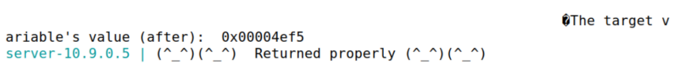

Ou seja, é possível concluir que os endereços em "%x" não possuem todos 8 bytes, neste caso. Para obter o valor real do número de caracteres, primeiro testamos o número de caracteres devolvidos por "%x" com o seguinte *payload*:

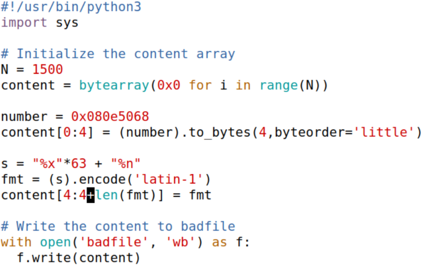

Com esse *payload*, obtivemos o seguinte resultado:

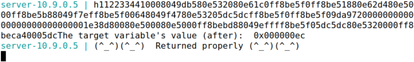

0x000000ec, em decimal, corresponde a 236. Esse número corresponde ao endereço do "target" (4 bytes) + os endereços lidos por "%x" (232).
Logo, o número exato de caracteres no *payload* deverá ser 20480 - 236 = 20244:

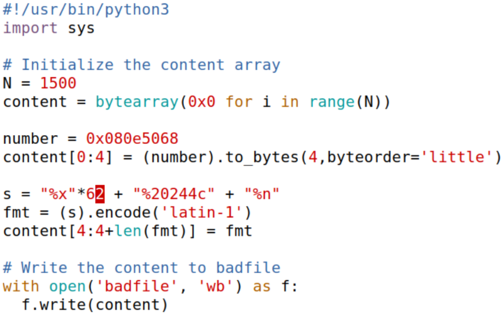

Porém, ao correr, o número não foi o esperado:

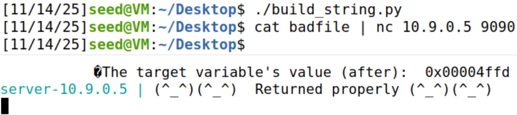

Foram retornados 3 bytes a menos que o expectável (0x00004ffd = 20477). Este desfasamento pode ser explicado pelo alinhamento feito na stack para variáveis de determinados tamanhos. 
Ao corrigir o *payload*, foi possível obter a quantidade correta de bytes:

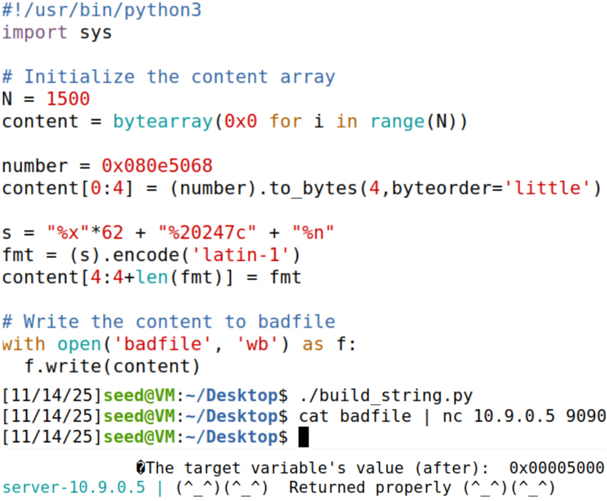

## **Questão 2**

