# XSS Lab

## Setup do Ambiente

Primeiramente, temos de colocar os websites para os ataques na pasta "/etc/hosts", para que sejam acessíveis após a iniciação dos containers:

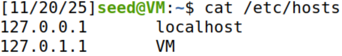
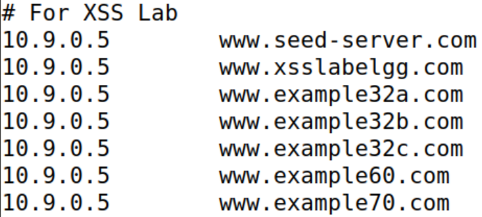

Depois, construímos e corremos os containers para iniciar a base de dados e tornar os sites acessíveis:

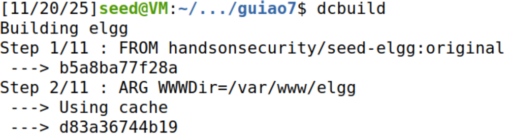
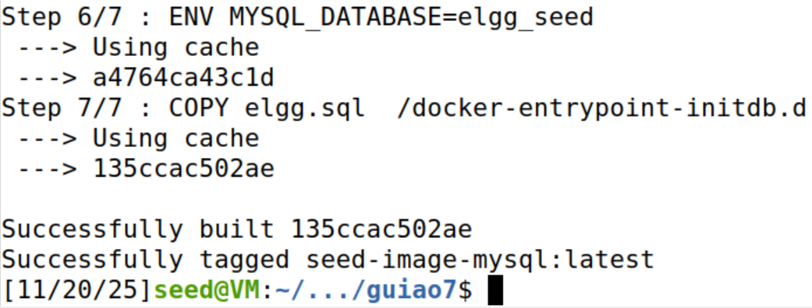
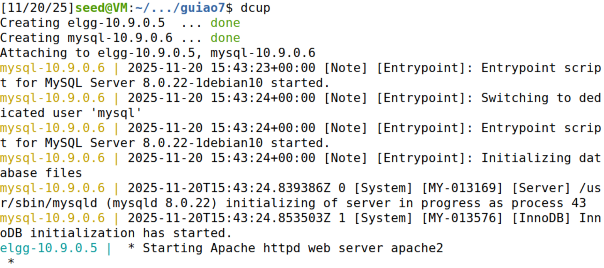

## Questão 1

### Task 1

Para a *task* 1, foi utilizado o site "www.seed-server.com" com a segunda conta disponibilizada, "alice":

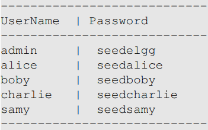

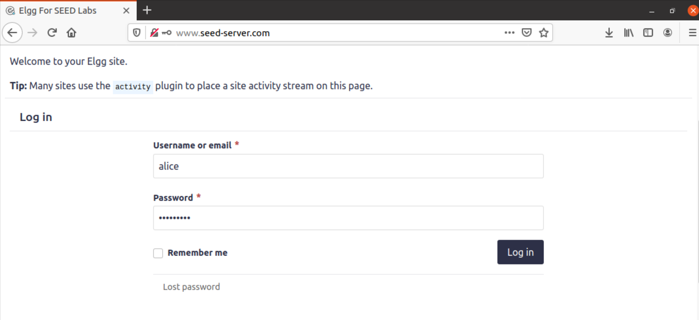

Ao navegar para a página "Profile" e clicar em "Edit Profile", verificaremos que é possível escrever código JavaScript funcional no campo "Brief Description". Será utilizado o código disponibilizado pelo guião: 

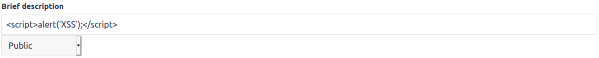

Este trecho de código exibirá um alerta no ecrã quando qualquer utilizador visitar o perfil "alice":

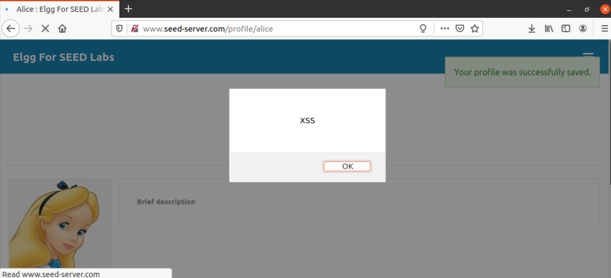

### Task 2

Para a *task* 2, será, novamente, escrito código JavaScript no campo "Brief Description", o mesmo disponibilizado no guião:

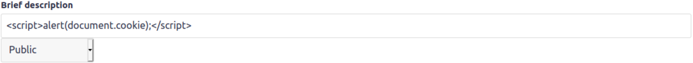

De um modo similar ao código da *task* anterior, será exibido um alerta no ecrã para qualquer utilizador que visitar o perfil "alice".
Porém, desta vez, o alerta exibirá os cookies do utilizador:

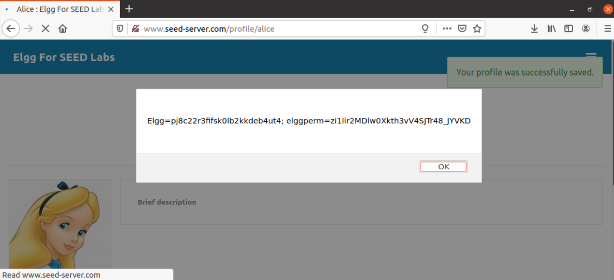

### Task 3

Para a *task* 3, diferentemente das anteriores, o objetivo do código JavaScript será para roubar informações, não exibi-las.

Primeiramente, é necessário abrir um servidor TCP para ouvir no *port* onde serão transmitidas as informações desejadas, isto é,
os cookies do utilizador:

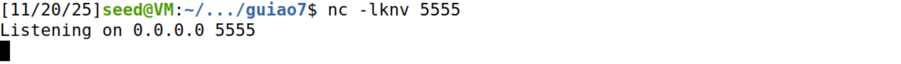

Após isso, escrevemos o código malicioso JavaScript disponibilizado no guião:

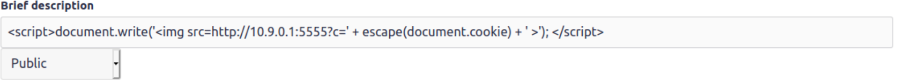

Este código insere um elemento "img" que envia os cookies da vítima para o *port* 5555, utilizando um pedido "HTTP GET".

Ao salvar as alterações, podemos verificar a existência de uma imagem aparentemente vazia:

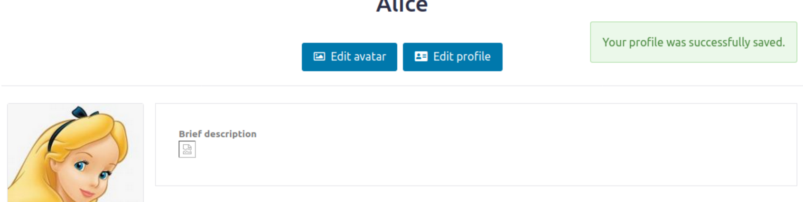

Se checarmos o servidor iniciado no terminal, é possível confirmar que o ataque foi bem sucedido: obtivemos os mesmos cookies apresentados
anteriormente na *task* 2, isto é, os cookies do utilizador "alice":

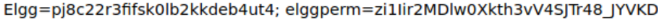

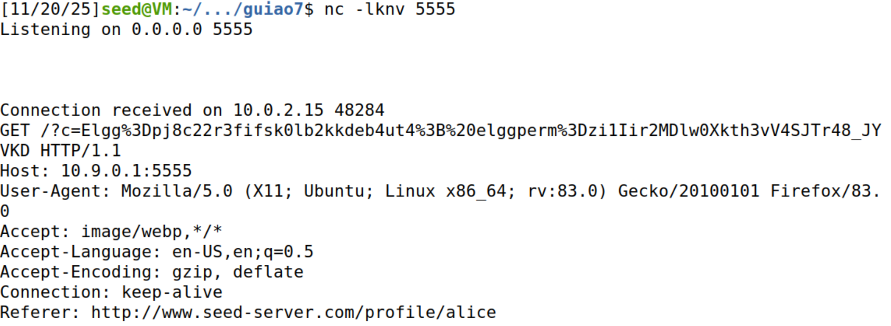

### Task 4

Para a task 4, o objetivo é fazer com que, quando algum utilizador entre no nosso perfil (o perfil do Samy neste caso), o visitante se torne amigo do Samy (inspirado na Samy Worm). 

Inicialmente, como referido no guião, será necessário descobrir como é que as adicções de amigos são enviadas para o servidor. Para isto, utilizaremos a extensão "HTTP Header Live" para analisar os pedidos HTTP enviados ao servidor. Sendo assim, como Samy, adicionaremos a Alice como amiga:
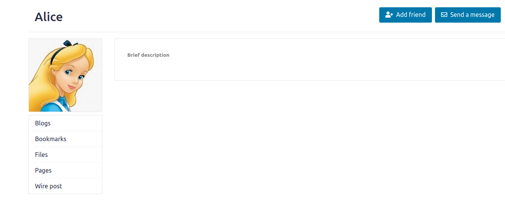
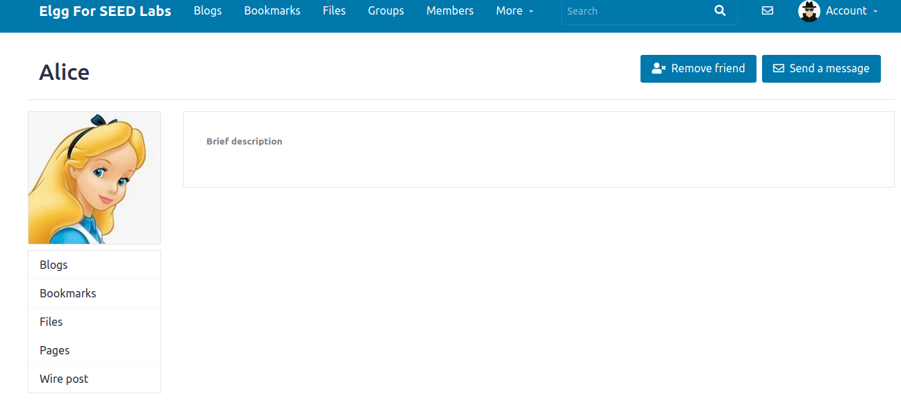

E podemos verificar o seguinte header:
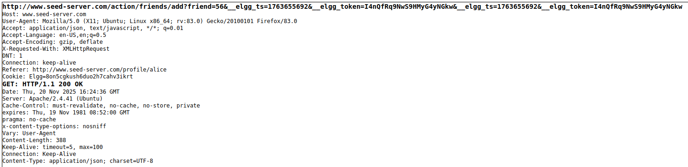

Mais importante é o URL, que nos dá o formato do pedido que teremos que utilizar:
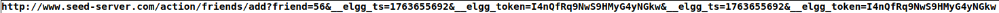

Deste URL conseguimos identificar 3 elementos principais:
- Representado a azul, o que aparenta ser o ID do alvo da adição;
- Representado a amarelo, o elgg_ts;
- Representado a vermelho, o elgg_token.
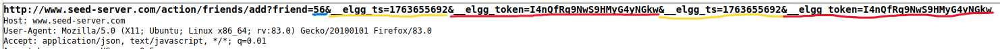

O elgg_ts e o elgg_token aparentam ser algum método de identificação e confirmação de quem envia o pedido, pelo que estes terão que ser extraídos do browser do usuário no qual este script executar quando o usuário abrir o perfil do Samy.
Quanto ao ID, o da Alice é o 56, mas o do Samy não aparece em lado algum deste URL.
Se analisarmos os pedidos feito ao servidor, vamos encontrar dois pedidos que nos poderão ajudar a descobrir o ID do Samy, ambos relacionados a imagens:
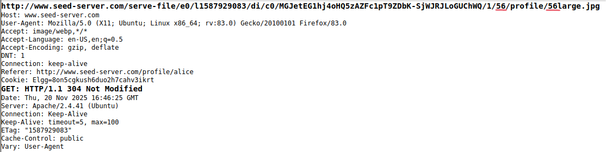

Neste pedido, no URL, conseguimos ver que o número 56 aparece referido duas vezes e temos quase a certeza de que este é o identificador da Alice. Este pedido parece se referir à obtenção da imagem no perfil dela. Se verificarmos os pedidos acima, vamos encontrar um pedido similar, mas, desta vez com o número 59 e uma imagem com small no nome, em vez do large da imagem da alice:
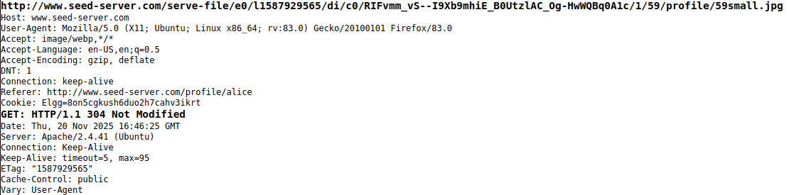

Estes pedidos aparentam referir-se às imagens indicadas na imagem abaixo e os seus nomes aparentam referir o valor do ID do respetivo usuário:

Isto leva-nos a suspeitar que o ID do Samy será 59, mas, para confirmar, iremos ao perfil do Samy confirmar. 
Ao analisar os pedidos enviados ao abrir o perfil do Samy, encontramos o seguinte pedido, análogo ao pedido no perfil da Alice:
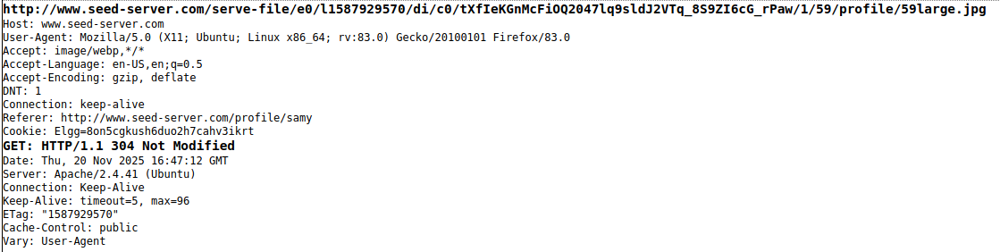

Sendo assim, que o ID do Samy é o 59 e podemos começar a montar o ataque. O script fornecido pelo guião dá-nos a base que utilizaremos, incluindo, a obtenção dos elgg_ts e do elgg_token, pelo que apenas teremos que montar o URL. O URL será igual ao do pedido HTTP analisado inicialmente até aos atributos que serão: "friends=59" + ts + token + ts + token (ts e token estão definidos no script como a string "&__elgg_ts=" + elgg.security.token.__elgg_ts e "&__elgg_token=" + elgg.security.token.__elgg_token, respetivamente, que permitem obter os valores dos tokens de segurança anteriormente referidos). Sendo assim, ficamos com o script seguinte:
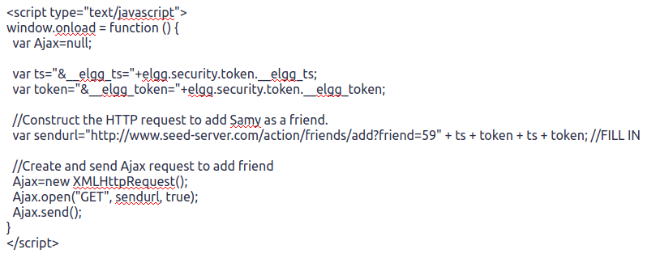

Agora, guardamos este script no "About Me" do perfil do Samy recorrendo ao modo texto para que, quando alguém abrir o perfil do Samy, o browser execute o script.

A partir da conta da Alice, é possível ver o ataque em ação. Abrindo o perfil do Samy:
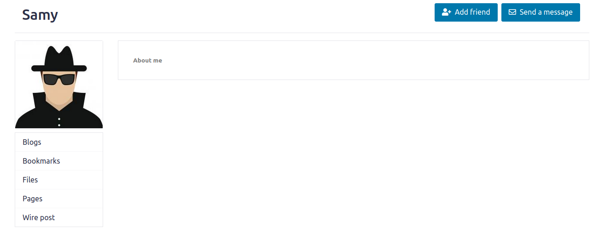

Como a secção do "About Me" só é renderizada pelo browser após a renderização do botão "Add friend", a adição não é instantaneamente visível, mas, se dermos refresh à página, veremos que o botão agora aparece como "Remove friend" indicando que o ataque do Samy foi bem sucedido.

Tentamos uma segunda vez com a conta do Boby:  
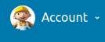

E o resultado foi o mesmo, abrindo o perfil do Samy:
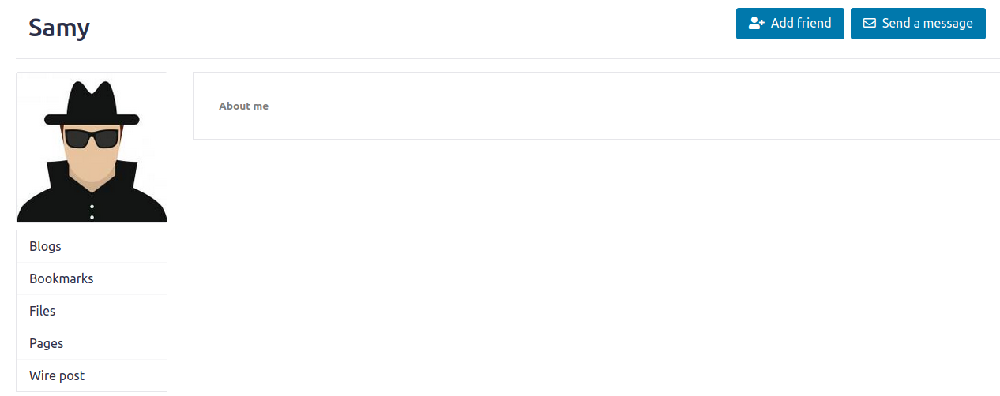
e fazendo um refresh à página, vemos que o Samy foi adicionado como amigo:
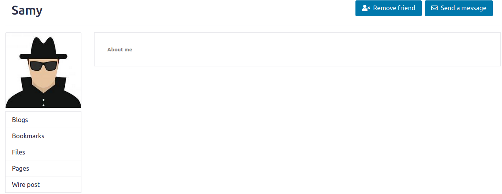

#### Questão 1
As variáveis __elgg_ts e __elgg_token parecem ser tokens de segurança para evitar que um utilizador consiga fazer alterações em nome de outro. Como tal, para que seja possível fazer com que o script adicione o Samy como amigo de um outro ultilizador (Alice, por exemplo), teremos que obter estes tokens para contornar esta verificação e o pedido parecer legítimo, ou seja, como tendo sido feito pelo utilizador alvo.

#### Questão 2
Tendo acesso apenas ao modo de Editor na secção "About Me" não é possível executar um ataque bem sucedido deste género recorrendo à secção do "About Me", pois o modo Editor vai fazer "escape" em todos os caracteres especiais no script, impedindo que este seja executado como HTML e Javascript válidos e, em vez disso, vai apenas renderizar o script como texto normal. 
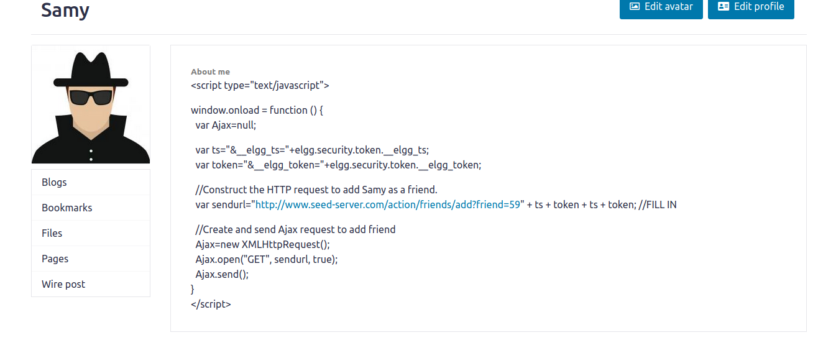

No entanto, recorrendo a outros campos de texto como o "Brief Description", ainda é possível executar o ataque como demonstrado nas imagens abaixo com o Samy e o Bob.
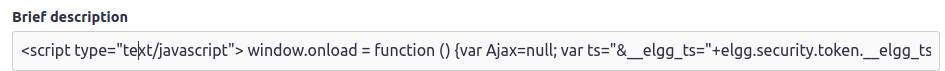
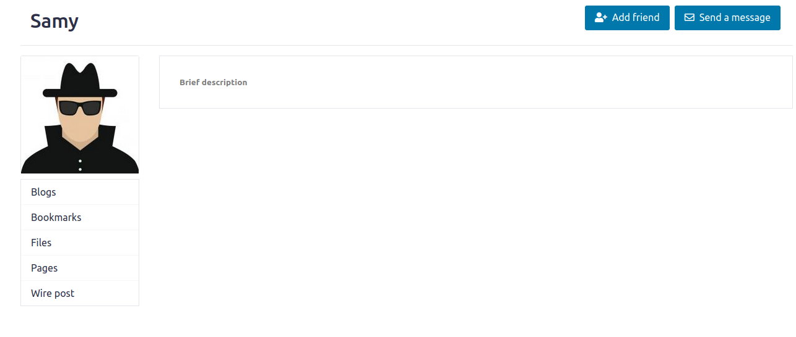
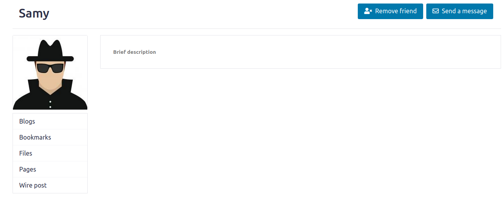

## Questão 2

As *tasks* 1-4 representam ataques do tipo *Stored* XSS, já que envolvem guardar um código JavaScript malicioso na base de dados e esperar que este corra na máquina de quem o "requisitar" ao servidor. 

Nas tasks 1-3, o código é guardado no campo "Brief Description" do perfil do utilizador "alice". Quando um utilizador acessa este perfil, o código é executado.
Similarmente, na task 4, o código é guardado na base de dados, associado ao campo "About Me" do perfil do utilizador "samy" e, quando um utilizador acessa este perfil, este código é, também, executado.