# Secret Key Incription Lab

## Setup do Ambiente

Para este lab, será necessário apenas fazer setup dos containers docker incluídos na pasta de setup:

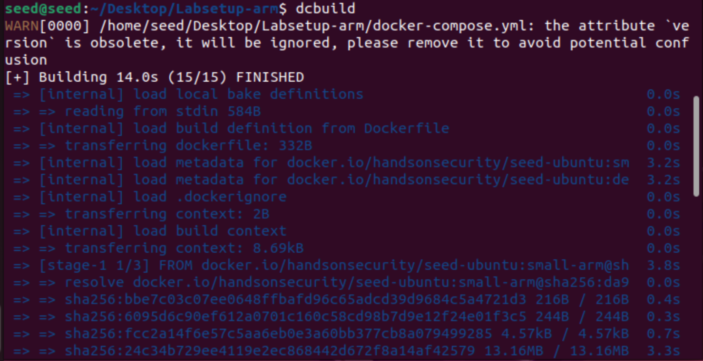
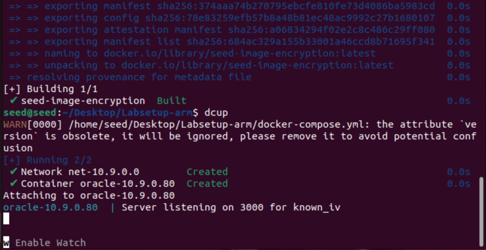

## Tarefa 1

Utilizando a frequência com que as letras e combinações apareçem no texto (obtidas a partir do programa "freq.py"), podemos inferir
sobre o que algumas delas representam. Por exemplo:

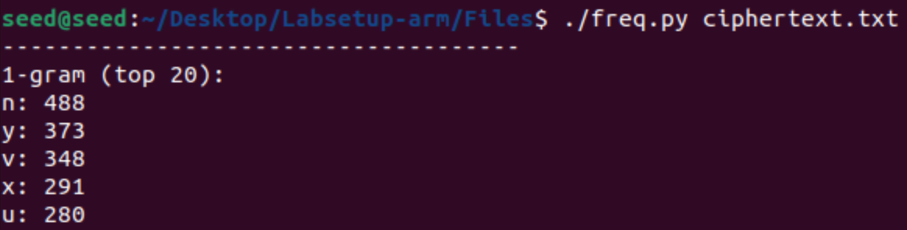

Aqui, podemos pensar que, na cifra, n representa uma vogal, já que são as letras mais comuns em textos, num geral.

De acordo com a Wikipedia, "the" é o trigrama mais comum no Inglês:

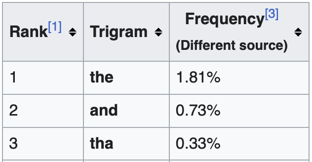

Verificando a frequência dos trigramas:

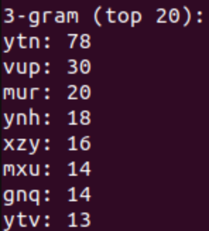

Podemos assumir que "ytn" corresponde a "the".

Para fazer essa substituição, executamos o comando "tr":

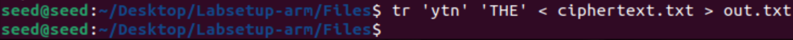

Comparando os arquivos, é possível verificar as mudanças:

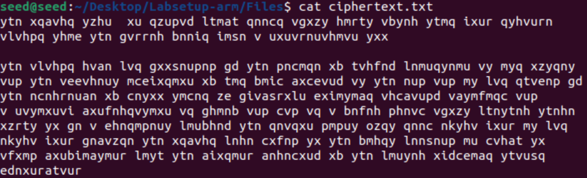

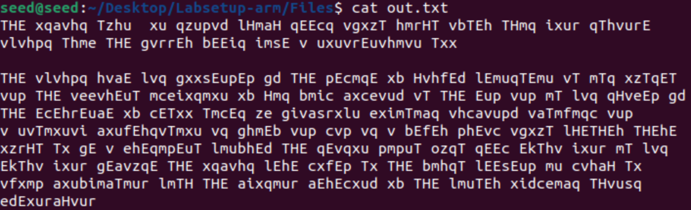

Nessa fase inicial, conseguimos descobrir outras letras e palavras a partir da análise de outras frequências.
Depois de um certo ponto, podemos descobrir as outras letras por intuição, pois as palavras estarão mais completas.

No final, descobrimos que a encriptação é a seguinte:

| Ciphertext | Plaintext |
|---|---|
| a | c |
| b | f |
| c | m |
| d | y |
| e | p |
| f | v |
| g | b | 
| h | r |
| i | l |
| j | q |
| k | x |
| l | w |
| m | i |
| n | e |
| o | j |
| p | d |
| q | s |
| r | g |
| s | k |
| t | h |
| u | n |
| v | a |
| w | z |
| x | o |
| y | t |
| z | u |

Aplicando o comando ao arquivo "ciphertext.txt", podemos verificar que o primeiro e segundo parágrafos se encontram completamente decifrados e sem erros de escrita:

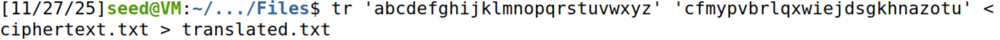
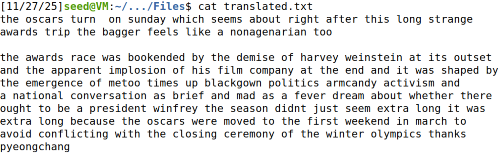

O arquivo final traduzido está em "translated.txt".

## Tarefa 2

Para a tarefa 2, criamos um arquivo "plaintext.txt" contendo 1005 caracteres, isto é, 1005 bytes:

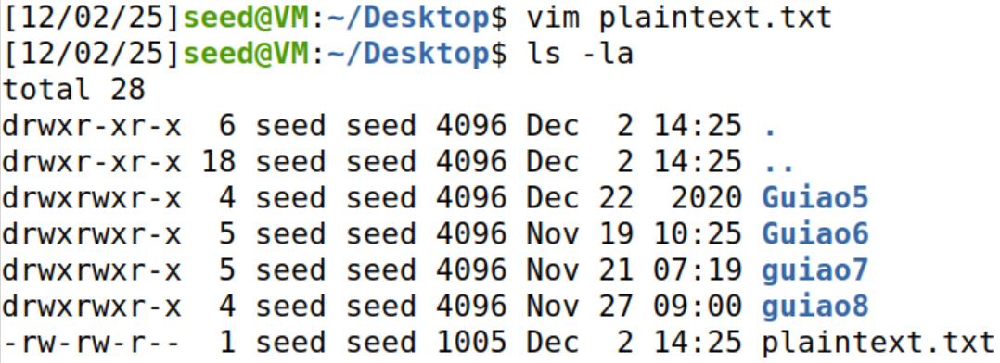


Como teremos que cifrá-lo utilizando aes-128, será necessário gerar uma chave de 128 bits/16 bytes:

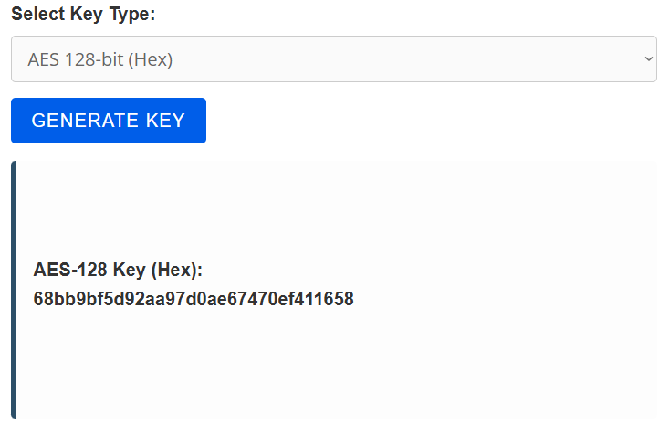

Essa será a chave utilizada para as cifras: 68bb9bf5d92aa97d0ae67470ef411658.

### aes-128-ecb

Para a primeira cifra, utilizamos o seguinte comando:

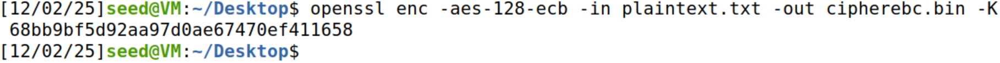

A flag "-aes-128-ecb" indica a cifra utilizada, "-in" e "-out" indicam os arquivos de input e output respectivamente, e "-K" indica a chave utilizada.
Como o modo de encriptação é o *default*, podemos omitir a flag "-e".

Este modo de encriptação não necessita de um vetor de inicialização, pelo que a flag "-iv" não é utilizada.

Após o comando, verificamos que o arquivo foi cifrado corretamente:

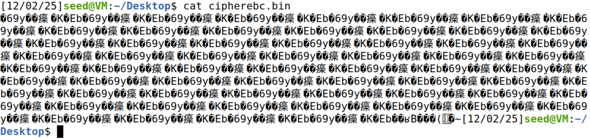

Para decifrar o arquivo, será necessário utilizar a flag "-d", indicando modo de decriptação. Para além disso, devemos também modificar o arquivo de entrada para o arquivo cifrado:

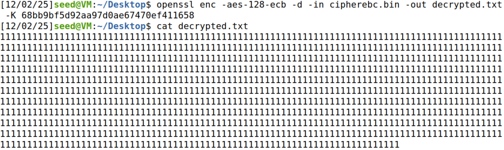

Com isso, temos o arquivo original novamente, decifrado com sucesso.

### aes-128-cbc

Para a segunda cifra, já será necessário utilizar a flag "-iv", pois este modo requer um vetor de inicialização. Este vetor tem de ter 128 bits, ou 16 bytes, ou seja, podemos gerar outra chave e utilizá-la como o nosso VI:

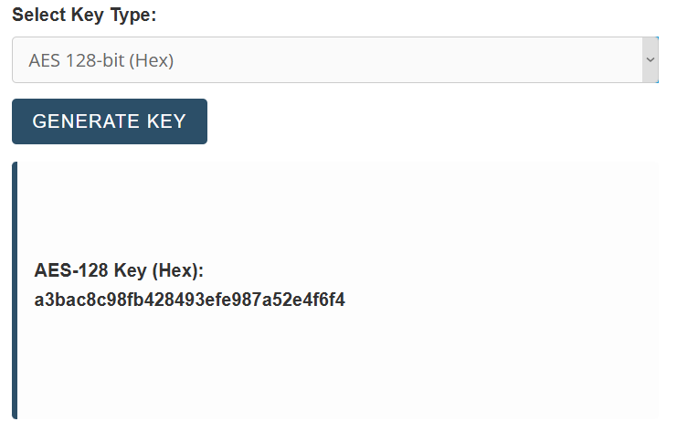

O VI será então: a3bac8c98fb428493efe987a52e4f6f4.

Com isso, podemos cifrar:

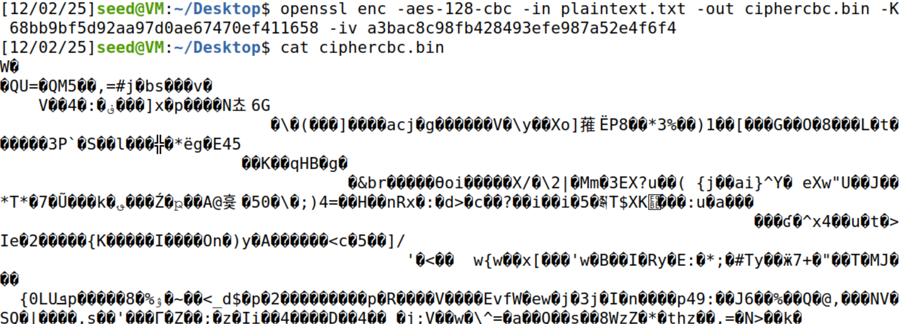

E decifrar o arquivo plaintext.txt:

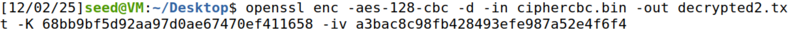
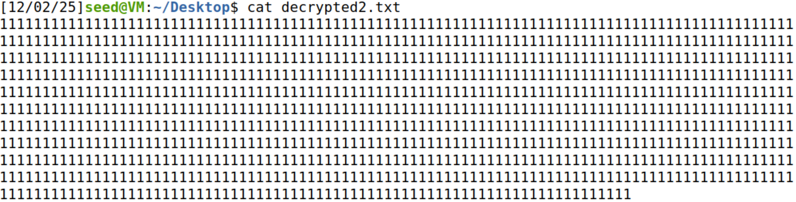

### aes-128-ctr

Para a última cifra, também será necessário um vetor de inicialização. Utilizando a mesma chave e VI anteriores:

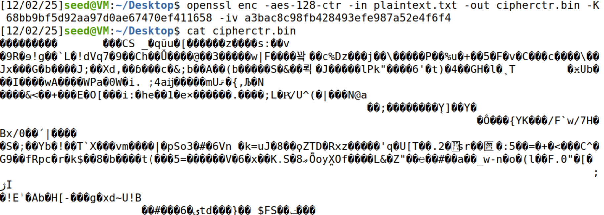

Decifrando o arquivo:

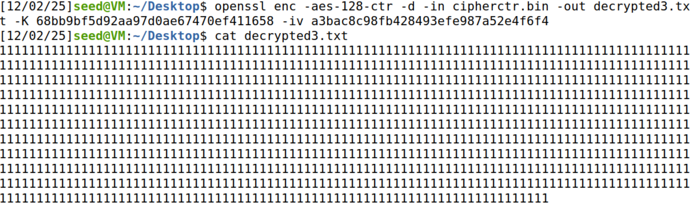

### Questões

Ao cifrar, foi necessário especificar as flags:
* "-aes-128-[mode]" para indicar o modo de encriptação;
* "-in" e "-out" para indicar os arquivos de entrada e saída;
* "-K" para especificar a chave utilizada;
* "-iv" APENAS para os modos cbc e ctr, pois estes necessitavam vetor de inicialização.

O modo "ecb" utiliza apenas a chave para encriptação, e cada bloco é cifrado isoladamente. Blocos iguais dão saídas iguais.

No modo "cbc", o vetor de inicialização é utilizado para cifrar o primeiro bloco: a partir disso a cifra de cada bloco depende do bloco anterior.

O modo "ctr" possui, além da chave e do VI, um contador. Cada bloco é cifrado com a chave, VI e contador, garantindo que blocos iguais tenham cifras diferentes.

Ao decifrar, foi necessário especificar as flags:
* "-aes-128-[mode]" para indicar o modo de encriptação;
* "-d" para o comando decifrar o arquivo de entrada, ao invés de cifrar;
* "-in" e "-out" para indicar os arquivos de entrada e saída;
* "-K" para especificar a chave utilizada;
* "-iv" APENAS para os modos "cbc" e "ctr", pois estes necessitavam vetor de inicialização.

A principal diferença entre o modo "ctr" e os demais é o contador. 
Ele permite que o "ctr" funcione como uma cifra de *stream*: um fluxo de bits semi-aleatórios (chave + VI + contador) é utilizado para cifrar o conteúdo original.

## Tarefa 5

Utilize o ficheiro plaintext.txt gerado anteriormente, e considere os três modos de cifra especificados anteriormente. Altere o byte 50*G, onde G é o número do vosso grupo prático (de 1 a 9) -- pode utilizar o editor bless, já instalado no ambiente disponibilizado.

Para cada um dos modos de cifra, indique quantos bytes de informação se perdem ao corromper um byte do criptograma. Verifique se esta perda se verifica quando se tenta ler a decifração dos criptogramas alterados.

Pista: desenhar o esquema correspondente a estes modos de cifra tende a facilitar a análise.

## Desafio

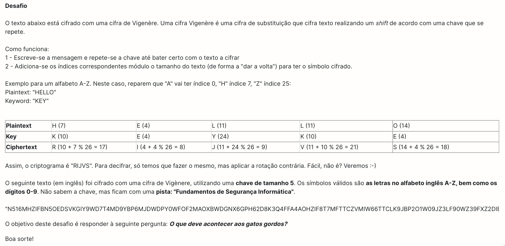

O desafio consiste em decifrar o criptograma fornecido, encriptado por uma cifra de Vigènere com uma chave de tamanho 5 e símbolos de A-Z e 0-9.

Criptograma: N516MHZIFBN5OEDSVKGIY9WD7T4MD9YBP6MJDWDPY0WFOF2MAOXBWDGNX6GPH62D8K3Q4FFA4AOHZIF8T7MFTTCZVMIW66TTCLK9JBP2O1W09JZ3LF90WZ39FXZ2DIBW5DJ9QK9Z7IF8YSS6OMWXGRJ9J27P01KON4MLCJ

Para descobrir a chave, o processo foi bastante simples e a chave foi facilmente descoberta numa só tentativa. A pista fornecida é: "Fundamentos de Segurança Informática". Uma das primeiras opções de que nos lembramos foi utilizar a sigla composta pela primeira letra de cada uma das palavras. Sendo assim, obtivemos uma chave de 3 elementos: FSI.
A presença de números nos símbolos válidos leva-nos a ponderar que a chave também conterá números. Ora, uma das opções mais comuns, frequentemente utilizada noutras disciplinas, é a sigla da disciplina seguida do ano civil ou letivo. Como apenas faltam 2 elementos da chave, concluímos que, provavelmente, seria o ano civil. Sendo assim, como estamos em 2025, extraímos 25.
Isto resulta na seguinte chave: **FSI25**.

Para testar a nossa chave, criámos o seguinte script em Python para decifrar a mensagem:

```python

def decypher_vigenere(c, k):
    sym = ['A', 'B', 'C', 'D', 'E', 'F', 'G', 'H', 'I', 'J', 'K', 'L', 'M',
            'N', 'O', 'P', 'Q', 'R', 'S', 'T', 'U', 'V', 'W', 'X', 'Y', 'Z',
            '0', '1', '2', '3', '4', '5', '6', '7', '8', '9']
    msg = ""
    k_pos = 0
    
    for ch in c:
        c_ind = sym.index(ch)
        k_ind = sym.index(k[k_pos])
        msg += sym[(c_ind - k_ind) % len(sym)]
        k_pos = (k_pos + 1) % len(k)
    
    return msg

msg = input("Enter the cipher text: ").upper()
key = input("Enter the key: ").upper()
plain_text = decypher_vigenere(msg, key)
print("The plain text is:", plain_text)

```

E o resultado foi o seguinte:

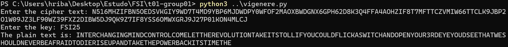

Quando as palavras são propriamente separadas, obtemos:
"INTERCHANGING MIND CONTROL COME LET THE REVOLUTION TAKE ITS TOLL IF YOU COULD FLICK A SWITCH AND OPEN YOUR 3RD EYE YOUD SEE THAT WE SHOULD NEVER BE AFRAID TO DIE RISE UP AND TAKE THE POWER BACK ITS TIME THE"

Com uma pesquisa rápida, descobrimos que esta mensagem corresponde a um trecho da música "Uprising", do album "The Resistance" dos Muse. Na letra da música, encontramos a resposta ao desafio:

P.: "O que deve acontecer aos gatos gordos?"<br>
R.: Os gatos gordos devem ter um ataque cardíaco.<br>
("It's time the fat cats had a heart attack")

Fonte: https://genius.com/Muse-uprising-lyrics